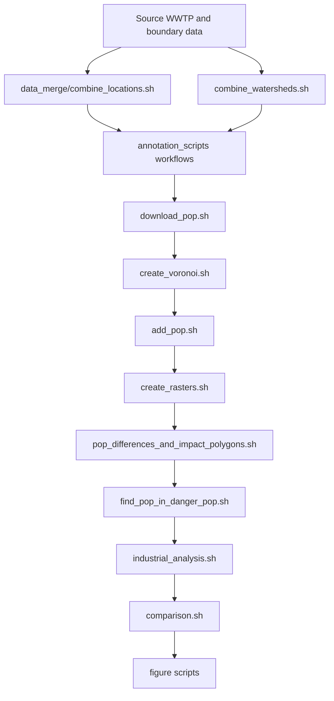
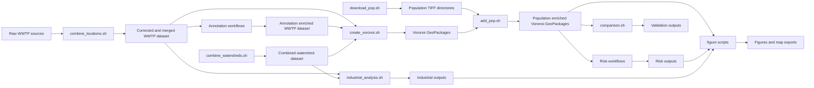
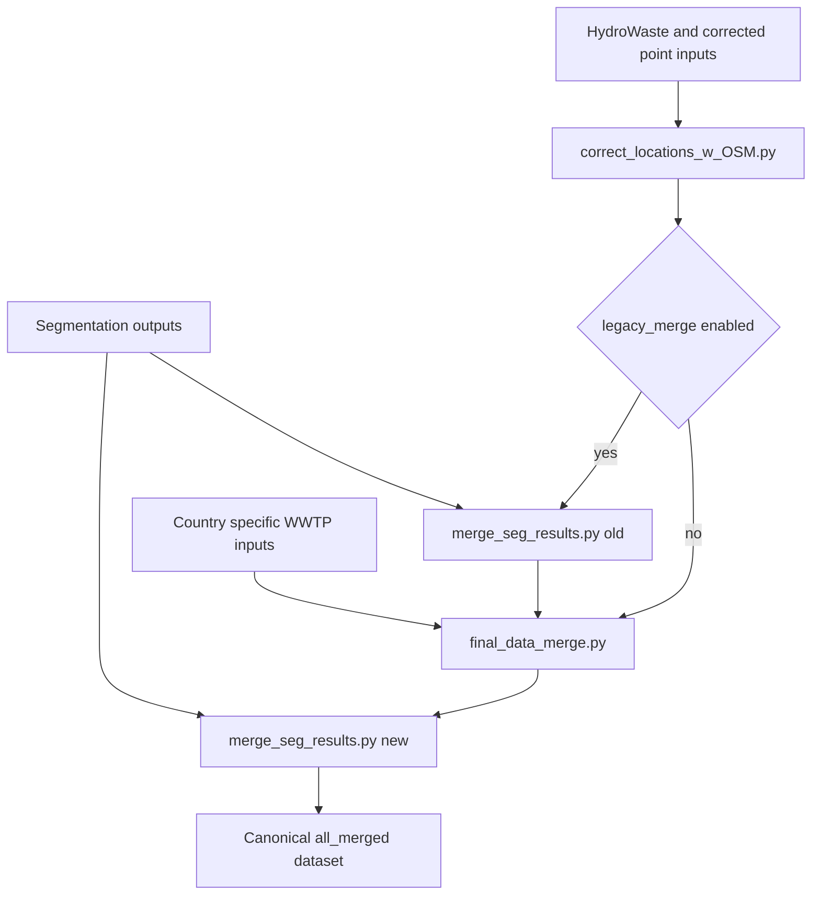
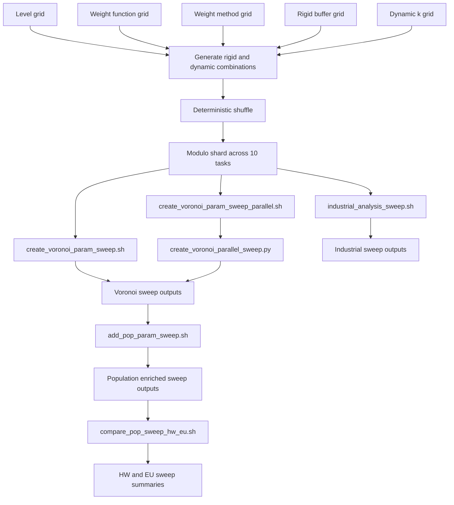
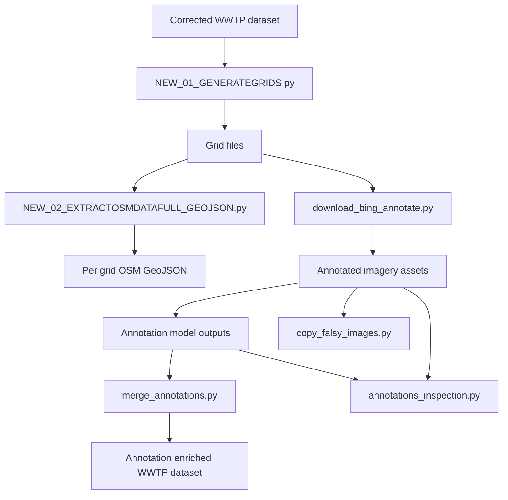
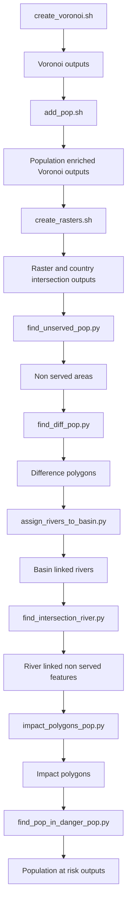
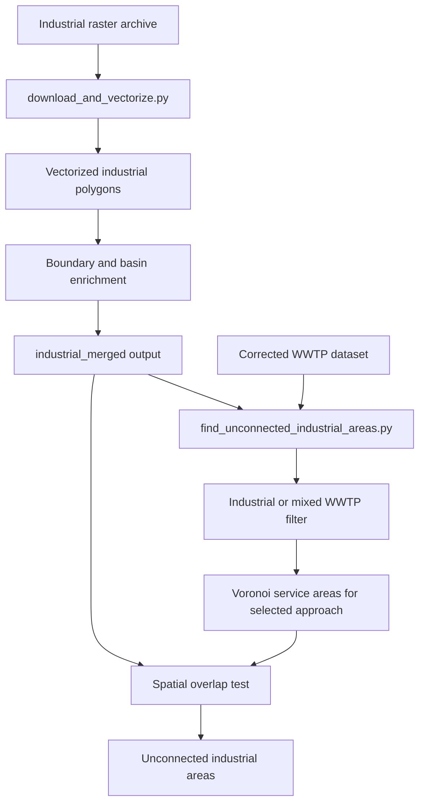

# plant_capacity

The repository is a pipeline which I have developed over a year. The initial idea was to see whether one could use AI to increase gaps in data regarding Waste Waster Treatment Plants (WWTPs) globally, for instance w.r.t the population being served, the type of WWTP (residential, industrial, mix usage, etc.). The idea was that one could probably approximate the service area of a WWTP by Voronoi triangulations provided that the coverage of WWTP is adaquate so that WWTPs do not errenously extend to the areas which are served by other uncovered WWTP, not available in the WWTP dataset. 

A reliable dataset with WWTP locations are needed and given the global scope of this project; this is, however easier said than done. HydroWASTE has published a global WWTP dataset which covers around 59K points (AI check this please, add reference). A drawback of their work is however, is that, in some cases the points are not located where the WWTP should be, but where it discharges. To this end, Paul (John Hopkins University, find him and add reference) used ML to scan the given WWTP location within a radius and if found, assigned it as the new geometry of the given WWTP. I have scanned the OpenStreetMap database for the remaining locations within 5 km radius and assigned the OSM geometry if there were any turnouts in OSM, otherwise the location was discarded. A similar approach was taken regarding the WWTP locations from European dataset (AI, add references). Extra points were also added wrt the United States, Canada, Germany and Thailand.

However, using Voronoi tesselation to estimate service areas does not take river topology into consideration. It is costly to transport water across different watersheds. Hence, it makes sense to assign a WWTP to a watershed and then do the analysis across such basins. Watershed basins come in different levels though. The level is, hence a free parameter and will affect how the results are. The higher the level, more WWTPs are grouped together leading to a smoothing out of differences. The lower the level, the bigger the individual differences and the WWTPs stop interacting with each other. The repo allows different levels which can be changed either via the config or overridden in runtime. These can be downloaded from HydroBASIN (add context here, references) as zip files. The zip files for a level 'X' should be put under 'data/hydroshed_river_levels/lvl{x}'. 

There are 3 different approaches which can be used. However the leading idea is the same. Voronoi cells are created for each buffer and corresponding points individually. 
- Approach 1 builds buffers around WWTPs and then group and dissolve intersecting buffers with another. This dissolved buffer will serve as the 'basin' for the WWTPs therein.
- Approach 2 groups WWTPs based on some buffer layer. Since this is a WWTP related repo, the buffers are watershed boundaries. However, the code itself is general enough to be adapted into a different domain (replace watershed with admin boundaries, WWTP data with health infrastructure and define and pass your own functions as to how buffer and weight creation works wrt. your data speficifics and Voila, health infrastructure estimation). 
- Approach 3 groups WWTPs based on their city identification. This approach has been suggested while discussing how best to relate WWWTPs and Voronoi cells. It works the other way around. Cities are buffered, the population inside is divided between WWTPs therein using Voronoi cells. Not actively used in the repo, though the functionality is there, if need be. 

Even though using watersheds as buffers should increase accuracy, Voronoi triangulation treats all locations evenly which does not reflect the actual differences between WWTPs. A WWTP which has more treatment area should have more influence. A possible solution is to provide a custom distance function which changes with weights. I could not find a readily available implementation of weighted Voronoi, so I have implemented it myself. To make things computationally easier, the code creates and xy-plane with resolution 'n_steps' meters between points and then checks whether the point falls within whose area of influence. There are three different distance functions: 
- 1. Euclidean distance without weights
- 2. Multiplicative euclidean distance, the distance is scaled by weights (the higher the weight, the smaller the distance)
- 3. Additive euclidean distance, weights are scaled by the mean distance between locations in the buffer to have some units and then subtracted from the distance. 

Furthermore, the weights are normalized across the same buffer. The function which calculates the weights from ML-related tags such as the number of ponds and the total treatment pond area, can be changed. To encode both information, the function takes 'total_area*sqrt(number of ponds)'. Then based on the chosen 'weight_func' (check this AI), the results are transformed based on (fill this and explain them):
	- linear: no change
	- square root: 
	- some thing
	- some thing   

A result of Voronoi triangulation is that it splits the given are completely between different locations. This might, depending on the size of the basin/dissolved buffer, could lead to locations getting improportionally big areas, say when the basin is big and/or there are no other facilities in the vicinity. To overcome this, an extra clipping is done after the cell creation. The clipping geometry is just a buffer around the location. This idea corresponds to the original HydroWASTE approach something. As one might notice, this is a free parameter. There are two main approaches which can be customized: 
	- 1. static buffering: a custom buffer will be applied consistenly across all locations
	- 2. dynamic buffering: the buffer should depend on the conditions of each individual location such as size

the dynamic buffering cam be turned via config (add which tag here and how) or via overriding it in runtime (add how). If static buffering is 
 


`plant_capacity` is a geospatial analysis pipeline for wastewater treatment plant (WWTP) service-area modelling, population attribution, downstream risk analysis, industrial-coverage diagnostics, validation, and sensitivity analysis. The repository combines harmonized WWTP point data, watershed boundaries, optional annotation-derived weighting inputs, WorldPop rasters, HydroSHEDS-derived river products, and industrial land rasters into a reproducible workflow designed for local bash execution and SLURM-based batch runs.

The codebase is not a model-training repository. Segmentation outputs, annotation model outputs, and other machine-generated products are treated as upstream inputs. The repository itself focuses on geospatial data preparation, weighted Voronoi service-area generation, raster-vector analysis, diagnostics, and reporting.

## Overview

### Core outputs

| Output family | Description | Primary producers |
| --- | --- | --- |
| Harmonized WWTP datasets | Corrected and merged point datasets assembled from HydroWaste, OSM-assisted corrections, segmentation outputs, and country-specific inputs | `data_merge/combine_locations.sh`, `final_data_merge.py` |
| Watershed base layers | Combined HydroBASIN-style watershed layers per configured level | `combine_watersheds.sh`, `combine_watersheds.py` |
| Voronoi service areas | Weighted or unweighted service polygons for multiple approaches | `create_voronoi.sh`, `create_voronoi.py` |
| Population-enriched Voronoi layers | Voronoi polygons with yearly zonal population statistics | `add_pop.sh`, `add_pop.py` |
| Non-served and risk layers | Non-served population areas, river-linked impact polygons, and population-at-risk outputs | `create_rasters.sh`, `pop_differences_and_impact_polygons.sh`, `find_pop_in_danger_pop.sh` |
| Industrial analysis products | Vectorized industrial polygons and industrial areas outside industrial or mixed WWTP coverage | `industrial_analysis.sh`, industrial analysis modules |
| Validation products | Verification subsets and HydroWaste or EU comparison diagnostics | `comparison.sh`, validation scripts |
| Figures and map outputs | Static figures, interactive HTML maps, and lightweight GeoJSON exports | figure scripts under `research_code/figures_scripts` |
| Sweep diagnostics | Parameter-combination outputs and cross-run sensitivity summaries | `sensitivity_analysis_scripts` |

### Workflow summary

| Order | Stage | Main purpose | Primary scripts |
| --- | --- | --- | --- |
| 1 | Data merging and harmonization | Build the canonical WWTP point dataset | `data_merge/combine_locations.sh` |
| 2 | Watershed preparation | Merge watershed archives into reusable basin layers | `combine_watersheds.sh` |
| 3 | Annotation and weighting preparation | Build grids, extract OSM context, render annotation assets, merge annotation outputs | `annotation_scripts/*.sh` |
| 4 | Voronoi generation | Produce service-area polygons for one or more approaches | `create_voronoi.sh`, `create_voronoi.py` |
| 5 | Population enrichment | Intersect Voronoi outputs with country population rasters | `add_pop.sh`, `add_pop.py` |
| 6 | Risk and river-impact analysis | Build non-served layers, attach river topology, propagate impact downstream | `pop_at_risk_river_calculations/*.sh` |
| 7 | Industrial analysis | Vectorize industrial land and measure uncovered industrial areas | `industrial_analysis/industrial_analysis.sh` |
| 8 | Validation and communication | Compare against references, generate figures, and analyze parameter sensitivity | validation, figure, and sensitivity scripts |

## Installation And Environment

### Recommended environment

| Component | Requirement |
| --- | --- |
| Python | `>=3.9` |
| Execution shell | Bash-compatible shell for wrappers; local or SLURM execution |
| Packaging | Editable install from `research_code/` |
| Core dependency classes | `geopandas`, `shapely`, `rasterio`, `exactextract`, `duckdb`, `matplotlib`, `folium`, `cartopy`, `networkx`, `opencv-python`, `scipy`, `PyYAML` |

### Initial setup

Run from the repository root:

```bash
cd research_code
python -m pip install -e .
```

The package metadata lives in `research_code/pyproject.toml`. The editable install exposes the package as `research_code` and makes all `python -m research_code...` invocations available.

### Running tests

The initial test suite focuses on config parsing, path generation, and deterministic Voronoi helper behavior using small synthetic fixtures under `research_code/tests/`.

```bash
cd research_code
python -m pip install -e .[test]
cd ..
pytest --tb=short -q
```

### Important prerequisite data

The repository assumes that several input files already exist at the configured paths. Commonly required local files include:

- `data/bboxes.csv`
- `data/cities.csv`
- `data/cleaned_hydrowaste.csv`
- `data/wastewater_plant.geojson`
- `data/boundaries/ne_110m_admin_0_countries.shp` and its sidecars
- `data/extra_points/UWWTD_TreatmentPlants.gpkg`
- `data/extra_points/Canada_14_03_2025.csv`
- `data/extra_points/US_mapped_data_final.csv`
- `data/extra_points/Germany_Hydra_waste_geospatial_corrected.geojson`

Several high-value inputs are machine-specific or mount-specific in the default configuration, including:

- `paths.seg_results_filepath`
- `paths.annotations_images_dir`
- `paths.annotations_results_filepath`

Verify these paths in `research_code/config.yaml` before running the full workflow.

## Repository Structure

### Top-level layout

| Path | Purpose | Role in pipeline |
| --- | --- | --- |
| `data/` | Raw inputs, intermediates, and generated outputs | Stores almost all configured inputs and outputs |
| `research_code/` | Executable package, shell wrappers, and configuration | Main implementation surface |
| `REPOSITORY_INVENTORY.md` | Repository inventory generated from code inspection | Supplemental internal documentation |
| `README.md` | Root project documentation | High-level entrypoint for users and developers |

### `data/`

This directory is the repository's data root. Most path templates in `research_code/config.yaml` resolve into subdirectories below `data/`.

| Subpath | Purpose |
| --- | --- |
| `data/boundaries/` | Country boundary shapefile components used for enrichment and clipping |
| `data/DL_results/` | Segmentation-related artifacts referenced by legacy and current merge flows |
| `data/extra_points/` | Country-specific WWTP source datasets used during final data merge |
| `data/final_data_source/` | Additional final source layers referenced by merge and analysis stages |
| `data/figures/` | Generated figures and interactive HTML exports |

### `research_code/`

This directory contains the Python package, orchestration wrappers, and shared runtime configuration.

#### Core orchestration files

| File | Purpose | Pipeline stage | Inputs and outputs | Key functions or classes | Called by | Manual run | Key configurable parameters |
| --- | --- | --- | --- | --- | --- | --- | --- |
| `research_code/starter.py` | Central configuration loading and CLI override parsing | Shared across all stages | Input: `config.yaml` plus optional CLI overrides. Output: flattened runtime configuration dictionary with resolved paths and runtime flags | `parse_config_overrides`, `load_config` | Imported by nearly every executable module | Imported, not typically run standalone | `level`, `version`, `buffer`, `weight_method`, `weight_func`, `dynamic_buffering`, `dynamic_buffer_k`; all YAML sections |
| `research_code/pipelines.py` | Shared orchestration helpers for Voronoi and output-path management | Shared across Voronoi, figures, industrial analysis, and raster-risk stages | Input: loaded config and GeoDataFrames. Output: output paths, prepared datasets, Voronoi results | `_resolve_configured_callable`, `create_output_paths`, `create_pop_output_paths`, `prepare_data`, `run_voronoi_approach` | Imported by `create_voronoi.py`, industrial analysis, figures, and sensitivity scripts | Imported, not typically run standalone | `prepare_data_fn`, `calculate_area_fn`, `calculate_buffer_fn`, output path templates, country and basin column names |
| `research_code/combine_watersheds.py` | Extract and merge readable geospatial layers from watershed zip archives | Watershed preparation | Input: configured watershed zip directory. Output: combined watershed GeoPackage | `extract_and_merge_geodata`, `main` | `combine_watersheds.sh` | `python -m research_code.combine_watersheds [level] [version] [buffer] [weight_method] [weight_func] [dynamic_buffering] [dynamic_buffer_k]` | `paths.watersheds_zip_dir`, `paths.watershed`, shared positional overrides |
| `research_code/download_pop.py` | Download, unzip, rasterize, and mosaic population data | Population input preparation | Input: WorldPop or HDX URLs. Output: country population rasters in configured population directories | `get_iso_codes`, `get_urls`, `download_save_and_unzip_pop`, `rasterize_csv`, `mosaic_large_rasters`, `process_all_countries`, `main` | `download_pop.sh` | `python -m research_code.download_pop [level] [version] [buffer] [weight_method] [weight_func] [dynamic_buffering] [dynamic_buffer_k]` | `paths.pop_dir`, `paths.pop_tif_dir`, `params.max_workers`, shared positional overrides |
| `research_code/create_voronoi.py` | Main weighted Voronoi generation entrypoint for approaches 0, 1, and 2 | Service-area generation | Inputs: corrected WWTP datasets, watershed or country layers, weighting controls. Outputs: Voronoi GeoPackages and optional buffer layers | `UnionFind`, `orchestrate_voronoi_weights`, `calculate_area`, `calculate_buffer`, `default_distance_additive`, `default_distance_multiplicative`, `main` | `create_voronoi.sh`, sensitivity scripts, industrial analysis reuse | `python -m research_code.create_voronoi [level] [version] [buffer] [weight_method] [weight_func] [dynamic_buffering] [dynamic_buffer_k] [--approach 0 1 2] [--only_round] [--verbose]` | `params.buffer`, `params.dynamic_buffering`, `params.dynamic_buffer_k`, `params.weight_method`, `params.weight_func`, `params.calculate_area_fn`, `params.calculate_buffer_fn`, `params.prepare_data_fn`, `execution.mode` |
| `research_code/add_pop.py` | Intersect Voronoi polygons with country population rasters and attach yearly zonal statistics | Population enrichment | Inputs: one Voronoi GeoPackage and configured population TIFF directories. Outputs: one population-enriched Voronoi GeoPackage | `intersect_single_file`, `find_country_tif_files`, `intersect_all_files`, `orchestrate_intersections`, `main` | `add_pop.sh`, `add_pop_param_sweep.sh` | `python -m research_code.add_pop <index> [level] [version] [buffer] [weight_method] [weight_func] [dynamic_buffering] [dynamic_buffer_k]` | leading file index, `paths.pop_tif_dir`, `paths.voronoi_dir`, `paths.pop_output_dir`, `params.add_pop_max_workers`, shared positional overrides |

### `research_code/data_merge/`

This directory constructs the canonical WWTP dataset used by all downstream modelling stages.

| File | Purpose | Pipeline stage | Inputs and outputs | Key functions | Called by | Manual run | Key configurable parameters |
| --- | --- | --- | --- | --- | --- | --- | --- |
| `research_code/data_merge/correct_locations_w_OSM.py` | Correct WWTP geometries using nearby OSM candidates and rule-based geometry selection | Data harmonization | Inputs: HydroWaste-like points, OSM-derived candidates, correction radius. Outputs: corrected point geometries | `corr_locations_wOSM`, `coordinate_corr_locations_wOSM`, `create_corrected_geom`, `main` | `data_merge/combine_locations.sh` | `python -m research_code.data_merge.correct_locations_w_OSM [level] [version] [buffer] [weight_method] [weight_func] [dynamic_buffering] [dynamic_buffer_k]` | `params.rad`, `paths.hydrowaste`, OSM and country enrichment paths, shared positional overrides |
| `research_code/data_merge/merge_seg_results.py` | Merge segmentation outputs into corrected WWTP geospatial datasets | Data harmonization | Inputs: segmentation CSV or zipped tile outputs plus corrected WWTP layers. Outputs: segmentation-enriched WWTP layers | `assign_to_nearest`, `merge_old`, `merge_new`, `parse_args`, `main` | `data_merge/combine_locations.sh` | `python -m research_code.data_merge.merge_seg_results [level] [version] [buffer] [weight_method] [weight_func] [dynamic_buffering] [dynamic_buffer_k] --variant {old,new}` | `booleans.legacy_merge`, `paths.seg_results_filepath`, `paths.dl_zipfile`, `paths.dl_mapfile`, shared positional overrides |
| `research_code/data_merge/final_data_merge.py` | Build the final merged WWTP dataset from regional and segmentation-adjusted sources | Data harmonization | Inputs: corrected regional layers plus country-specific imports. Outputs: final merged WWTP dataset at `corrected_all` | `cluster_point_indices`, imported `coordinate_corr_locations_wOSM`, `main` | `data_merge/combine_locations.sh` | `python -m research_code.data_merge.final_data_merge [level] [version] [buffer] [weight_method] [weight_func] [dynamic_buffering] [dynamic_buffer_k]` | `paths.corrected_all`, `paths.eu_ref_filepath`, country-specific source file paths, `params.threshold`, shared positional overrides |

### `research_code/annotation_scripts/`

This directory prepares annotation assets and folds annotation-derived information back into the core dataset. It influences weighting and quality-control workflows but is not itself the Voronoi solver.

| File | Purpose | Pipeline stage | Inputs and outputs | Key functions | Called by | Manual run | Key configurable parameters |
| --- | --- | --- | --- | --- | --- | --- | --- |
| `research_code/annotation_scripts/NEW_01_GENERATEGRIDS.py` | Generate annotation grids around WWTP points | Annotation preparation | Inputs: corrected WWTP points. Outputs: grid files keyed by tile index | `point_to_square`, `main` | `annotation_scripts/grid_generation_and_osm_extract.sh` | `python -m research_code.annotation_scripts.NEW_01_GENERATEGRIDS [level] [version] [buffer] [weight_method] [weight_func] [dynamic_buffering] [dynamic_buffer_k]` | `annotations.cell_size`, `annotations.factor`, shared positional overrides |
| `research_code/annotation_scripts/NEW_02_EXTRACTOSMDATAFULL_GEOJSON.py` | Query OSM context for each generated grid | Annotation preparation | Inputs: annotation grids. Outputs: per-grid GeoJSON context files | `query_overpass`, `elements_to_gdf`, `create_tasks`, `row_operation`, `main` | `annotation_scripts/grid_generation_and_osm_extract.sh` | `python -m research_code.annotation_scripts.NEW_02_EXTRACTOSMDATAFULL_GEOJSON [level] [version] [buffer] [weight_method] [weight_func] [dynamic_buffering] [dynamic_buffer_k]` | OSM query settings, output directories, shared positional overrides |
| `research_code/annotation_scripts/NEW_03_WASTEWATERJOIN_GEOJSON.py` | Join OSM wastewater context back to WWTP or grid records | Ancillary annotation utility | Inputs: GeoJSON context files and point records. Outputs: merged parquet or GeoJSON artifacts | `load_geodata`, `parallel_convert_geojsons`, `merge_parquets_sql`, `merge_bboxes_sql`, `main` | No shell wrapper in active workflow | `python -m research_code.annotation_scripts.NEW_03_WASTEWATERJOIN_GEOJSON [level] [version] [buffer] [weight_method] [weight_func] [dynamic_buffering] [dynamic_buffer_k]` | Shared positional overrides; script currently documented as not used |
| `research_code/annotation_scripts/NEW_04_EXPORTGEOTIFF.py` | Export selected geospatial products as GeoTIFF | Ancillary annotation utility | Inputs and outputs depend on export targets | Module exists; currently not documented as part of active tested workflow | No shell wrapper in active workflow | `python -m research_code.annotation_scripts.NEW_04_EXPORTGEOTIFF ...` | Shared positional overrides; script documented as not used and not tested |
| `research_code/annotation_scripts/download_bing_annotate.py` | Render annotated tile images for a deterministic subset of grids | Annotation imagery generation | Inputs: annotation grids, reference images, OSM-derived polygon and line context. Outputs: annotated PNG or GeoTIFF assets | `download_bing_image`, `split_grids_for_instance`, `draw_annotations`, `process_bbox`, `annotate_bboxes_parallel` | `annotation_scripts/run_download_bing_annotate_array.sh` | `python -m research_code.annotation_scripts.download_bing_annotate <instance_id> --num-instances <n> --split-seed <seed> [level] [version] [buffer] [weight_method] [weight_func] [dynamic_buffering] [dynamic_buffer_k]` | `annotations.max_workers`, `annotations.random_seed`, `annotations_images_dir`, `annotated_images_output_dir`, shared positional overrides |
| `research_code/annotation_scripts/merge_annotations.py` | Parse annotation-model text outputs and merge them into the corrected WWTP layer | Annotation post-processing | Inputs: annotation results files and corrected WWTP dataset. Outputs: corrected WWTP layer with annotation-derived fields | `decode_gen_text`, `parse_idx_from_image_name`, `main` | `annotation_scripts/merge_annotations.sh` | `python -m research_code.annotation_scripts.merge_annotations [level] [version] [buffer] [weight_method] [weight_func] [dynamic_buffering] [dynamic_buffer_k]` | `paths.annotations_results_filepath`, corrected WWTP paths, shared positional overrides |
| `research_code/annotation_scripts/annotations_inspection.py` | Build QA sampling artifacts for annotation review | Annotation QA | Inputs: annotation outputs and image folders. Outputs: class-distribution figures and sampled image folders | `plot_category_distribution`, `get_stratified_sample`, `organize_files_by_category`, `main` | `annotation_scripts/annotations_inspection.sh` | `python -m research_code.annotation_scripts.annotations_inspection [level] [version] [buffer] [weight_method] [weight_func] [dynamic_buffering] [dynamic_buffer_k]` | `annotations.n_sample_size`, `annotations.random_seed`, `annotations_images_dir`, shared positional overrides |
| `research_code/annotation_scripts/copy_falsy_images.py` | Copy selected images for QA handling | Annotation QA utility | Inputs: annotation image directories and selection logic. Outputs: copied image subsets | `main` | `annotation_scripts/copy_falsy_images.sh` | `python -m research_code.annotation_scripts.copy_falsy_images [level] [version] [buffer] [weight_method] [weight_func] [dynamic_buffering] [dynamic_buffer_k]` | Shared positional overrides |

### `research_code/industrial_analysis/`

This directory implements the industrial-coverage branch of the project.

| File | Purpose | Pipeline stage | Inputs and outputs | Key functions | Called by | Manual run | Key configurable parameters |
| --- | --- | --- | --- | --- | --- | --- | --- |
| `research_code/industrial_analysis/download_and_vectorize.py` | Download industrial raster archives, vectorize them, merge polygons, and enrich them with watershed and country attributes | Industrial analysis, stage 1 | Inputs: Zenodo raster archive, watershed layer, country boundary data. Outputs: cached and enriched industrial polygon GeoPackages | `download_file`, `vectorize_raster_file`, `vectorize_rasters_parallel`, `merge_geodataframes`, `add_boundary_info`, `_vectorize_and_merge`, `main` | `industrial_analysis/industrial_analysis.sh`, `industrial_analysis_sweep.sh` | `python -m research_code.industrial_analysis.download_and_vectorize [level] [version] [buffer] [weight_method] [weight_func] [dynamic_buffering] [dynamic_buffer_k]` | `params.industrial_zenodo_url`, `params.industrial_min_cells`, `params.industrial_persist_rasters`, `params.industrial_simplify_tolerance`, `params.industrial_vectorize_overwrite`, industrial raster and merged-output paths |
| `research_code/industrial_analysis/find_unconnected_industrial_areas.py` | Build industrial or mixed WWTP service regions and identify industrial polygons outside them | Industrial analysis, stage 2 | Inputs: industrial polygons, corrected WWTP dataset, watershed and country layers. Outputs: parquet of uncovered industrial areas | `load_industrial_areas`, `load_wwtps`, `filter_industrial_wwtps`, `run_voronoi_for_wwtps`, `find_unconnected_areas`, `main` | `industrial_analysis/industrial_analysis.sh`, `industrial_analysis_sweep.sh` | `python -m research_code.industrial_analysis.find_unconnected_industrial_areas [level] [version] [buffer] [weight_method] [weight_func] [dynamic_buffering] [dynamic_buffer_k] [--approach 0|1] [--only_round] [--verbose]` | `params.industrial_category_numbers`, `params.industrial_unconnected_overwrite`, `params.basin_column_name`, shared Voronoi parameters |

### `research_code/pop_at_risk_river_calculations/`

This directory computes non-served population, river-linked exposure, downstream impact, and final population-at-risk summaries.

| File | Purpose | Pipeline stage | Inputs and outputs | Key functions | Called by | Manual run | Key configurable parameters |
| --- | --- | --- | --- | --- | --- | --- | --- |
| `research_code/pop_at_risk_river_calculations/create_rasters.py` | Build signed rasters and country-wise non-served intermediate products from population-enriched Voronoi layers | Risk analysis, stage 1 | Inputs: population-enriched Voronoi outputs, population TIFFs, watershed layer. Outputs: raster products, CSV stats, non-served polygon intermediates | `extract_worldpop_universal`, `polygon_raster_sign_from_gdf`, `orchestrate_country_intersection`, `orchestrate_intersections`, `shard_tif_dict`, `main` | `create_rasters.sh` | `python -m research_code.pop_at_risk_river_calculations.create_rasters [job_index] [total_jobs] [level] [version] [buffer] [weight_method] [weight_func] [dynamic_buffering] [dynamic_buffer_k]` | `annotations.default_mode`, `annotations.max_workers`, `annotations.random_seed`, `params.min_pixels`, `params.zoom_level`, shared positional overrides |
| `research_code/pop_at_risk_river_calculations/find_unserved_pop.py` | Vectorize and export non-served population areas from raster outputs | Risk analysis, stage 2 | Inputs: raster outputs from `create_rasters.py`. Outputs: non-served area layers | `create_unserved_pop`, `main` | `find_unserved_pop.sh`, `pop_differences_and_impact_polygons.sh` | `python -m research_code.pop_at_risk_river_calculations.find_unserved_pop [level] [version] [buffer] [weight_method] [weight_func] [dynamic_buffering] [dynamic_buffer_k]` | `params.threshold`, risk-output paths, shared positional overrides |
| `research_code/pop_at_risk_river_calculations/find_diff_pop.py` | Compute population differences between watershed reference and population-enriched service products for one selected file index | Risk analysis, stage 3 | Inputs: one population-enriched Voronoi file and watershed reference. Outputs: difference GeoPackage | `find_difference`, `find_differences`, `parse_bool`, `parse_args`, `main` | `pop_differences_and_impact_polygons.sh` | `python -m research_code.pop_at_risk_river_calculations.find_diff_pop <index> [is_parallel] [level] [version] [buffer] [weight_method] [weight_func] [dynamic_buffering] [dynamic_buffer_k]` | leading file index, `is_parallel`, `params.max_workers`, `params.basin_column_name`, shared positional overrides |
| `research_code/pop_at_risk_river_calculations/assign_rivers_to_basin.py` | Assign river segments to basin identifiers | Risk analysis, stage 4 | Inputs: river layer and basin layer. Outputs: basin-linked river layer | Script-style river-basin assignment helpers and `main` | `assign_rivers_to_basin.sh`, `pop_differences_and_impact_polygons.sh` | `python -m research_code.pop_at_risk_river_calculations.assign_rivers_to_basin [max_workers] [level] [version] [buffer] [weight_method] [weight_func] [dynamic_buffering] [dynamic_buffer_k]` | leading worker count, `paths.rivershed`, `paths.watershed`, basin column settings, shared positional overrides |
| `research_code/pop_at_risk_river_calculations/find_intersection_river.py` | Link non-served features to nearby or intersecting river segments and assign topology metadata | Risk analysis, stage 5 | Inputs: non-served features and basin-linked river layers. Outputs: river-linked non-served features | `build_graph`, `optimize_river_lookup`, `orchestrate_settlement_river_intersections`, `assign_main_riv`, `orchestrate_river_assignment`, `main` | `find_intersection_river.sh`, `pop_differences_and_impact_polygons.sh` | `python -m research_code.pop_at_risk_river_calculations.find_intersection_river [max_workers] [level] [version] [buffer] [weight_method] [weight_func] [dynamic_buffering] [dynamic_buffer_k]` | leading worker count, search distance controls embedded in script logic, shared positional overrides |
| `research_code/pop_at_risk_river_calculations/impact_polygons_pop.py` | Propagate environmental load downstream and build impact polygons | Risk analysis, stage 6 | Inputs: river-linked non-served features and river topology. Outputs: impact polygons and summaries | `create_dicts`, `get_runtime_params`, `calculate_load_ratio`, `generate_single_segment_plume`, `create_impact_polygons`, `orchestrate_logic`, `main` | `pop_differences_and_impact_polygons.sh` | `python -m research_code.pop_at_risk_river_calculations.impact_polygons_pop [max_workers] [level] [version] [buffer] [weight_method] [weight_func] [dynamic_buffering] [dynamic_buffer_k]` | leading worker count, `impact_polygons_pop_params.*`, shared positional overrides |
| `research_code/pop_at_risk_river_calculations/find_pop_in_danger_pop.py` | Aggregate final population-at-risk outputs on tile and country units | Risk analysis, stage 7 | Inputs: impact-polygon outputs. Outputs: final population-at-risk parquet files | `find_tiles_in_countries`, `assign_tile_to_df`, `group_tile_population_sums`, `main` | `find_pop_in_danger_pop.sh`, figure scripts reuse `find_tiles_in_countries` | `python -m research_code.pop_at_risk_river_calculations.find_pop_in_danger_pop [level] [version] [buffer] [weight_method] [weight_func] [dynamic_buffering] [dynamic_buffer_k]` | `params.zoom_level`, output paths, shared positional overrides |

### `research_code/pop_validation_scripts/`

This directory provides QA and reference-comparison tooling for generated population-enriched outputs.

| File | Purpose | Pipeline stage | Inputs and outputs | Key functions | Called by | Manual run | Key configurable parameters |
| --- | --- | --- | --- | --- | --- | --- | --- |
| `research_code/pop_validation_scripts/verification_script.py` | Split population-enriched outputs into verification, non-verification, and single-site groups | Validation | Inputs: population-enriched outputs. Outputs: verification subsets in the configured verification directory | `find_verification_watersheds`, `main` | `comparison.sh` | `python -m research_code.pop_validation_scripts.verification_script [level] [version] [buffer] [weight_method] [weight_func] [dynamic_buffering] [dynamic_buffer_k]` | `params.percent_verification`, verification output paths, shared positional overrides |
| `research_code/pop_validation_scripts/hw_comparison.py` | Compare project outputs against HydroWaste reference population values | Validation | Inputs: verification subsets and HydroWaste-derived references. Outputs: comparison figures and metrics | `ndvi`, `multiples`, `replace_inf`, `extract_voronoi_parameters`, `main` | `comparison.sh`, reused by EU and sweep comparison modules | `python -m research_code.pop_validation_scripts.hw_comparison [level] [version] [buffer] [weight_method] [weight_func] [dynamic_buffering] [dynamic_buffer_k]` | HydroWaste path settings, zonal-sum columns, shared positional overrides |
| `research_code/pop_validation_scripts/eu_comparison.py` | Compare project outputs against the EU reference layer | Validation | Inputs: verification subsets and EU WWTP reference layer. Outputs: comparison figures and metrics | `composite_histogram`, imported `assign_to_nearest`, imported comparison helpers, `main` | `comparison.sh` | `python -m research_code.pop_validation_scripts.eu_comparison [level] [version] [buffer] [weight_method] [weight_func] [dynamic_buffering] [dynamic_buffer_k]` | `paths.eu_ref_filepath`, `params.eu_utm`, shared positional overrides |

### `research_code/figures_scripts/`

This directory creates publication or communication outputs from previously generated data products.

| File | Purpose | Pipeline stage | Inputs and outputs | Key functions | Called by | Manual run | Key configurable parameters |
| --- | --- | --- | --- | --- | --- | --- | --- |
| `research_code/figures_scripts/convert_voronoi_to_geojson_for_map.py` | Convert population-enriched Voronoi outputs into lightweight map-ready GeoJSON | Visualization | Inputs: population-enriched Voronoi outputs. Outputs: GeoJSON under the configured figures path | `main` | `figures_scripts/convert_voronoi_to_geojson_for_map.sh` | `python -m research_code.figures_scripts.convert_voronoi_to_geojson_for_map [level] [version] [buffer] [weight_method] [weight_func] [dynamic_buffering] [dynamic_buffer_k]` | figure output paths, shared positional overrides |
| `research_code/figures_scripts/composite_area_population_plots.py` | Create composite histogram and scatter diagnostics for area and population ratios | Visualization | Inputs: population-enriched Voronoi outputs and country boundaries. Outputs: histogram and scatter PNGs | `resolve_zonal_sum_column`, `build_country_table`, `make_histogram_plot`, `make_scatter_plot`, `main` | `figures_scripts/composite_area_population_plots.sh` | `python -m research_code.figures_scripts.composite_area_population_plots [level] [version] [buffer] [weight_method] [weight_func] [dynamic_buffering] [dynamic_buffer_k] [--approach ...] [--color-col ...]` | `figures.approach`, `params.zonal_sum_default_column`, `--zonal-col`, histogram quantile controls |
| `research_code/figures_scripts/piechart_figure.py` | Generate a static world map with country-level donut summaries | Visualization | Inputs: population-enriched outputs and country boundaries. Outputs: static PNG figure | `aggregate_by_country`, `plot_splitted_piechart`, `resolve_zonal_sum_columns`, `main` | Manual direct run documented in `research_code/figures_scripts/README.md` | `python -m research_code.figures_scripts.piechart_figure [level] [version] [buffer] [weight_method] [weight_func] [dynamic_buffering] [dynamic_buffer_k]` | figure output paths, zonal-sum columns, shared positional overrides |
| `research_code/figures_scripts/piechart_interactive.py` | Generate an interactive Folium map summarizing served population and WWTP mix | Visualization | Inputs: population-enriched outputs and country boundaries. Outputs: standalone HTML file | `aggregate_by_country`, `ensure_population_percentage_column`, `get_pie_svg`, `main` | Manual direct run documented in `research_code/figures_scripts/README.md` | `python -m research_code.figures_scripts.piechart_interactive [level] [version] [buffer] [weight_method] [weight_func] [dynamic_buffering] [dynamic_buffer_k]` | figure output paths, zonal-sum columns, shared positional overrides |
| `research_code/figures_scripts/pop_at_risk_figures.py` | Plot population-at-risk and impact polygon summaries | Visualization | Inputs: final risk outputs plus tile and country overlays. Outputs: risk-analysis figures | `_robust_bounds`, `create_single_plot`, `create_impact_polygon_plots`, `main` | `figures_scripts/pop_at_risk_figures.sh` | `python -m research_code.figures_scripts.pop_at_risk_figures [level] [version] [buffer] [weight_method] [weight_func] [dynamic_buffering] [dynamic_buffer_k]` | figure output paths, risk output files, shared positional overrides |

### `research_code/sensitivity_analysis_scripts/`

This directory performs parameter sweeps and cross-run evaluation.

| File | Purpose | Pipeline stage | Inputs and outputs | Key functions | Called by | Manual run | Key configurable parameters |
| --- | --- | --- | --- | --- | --- | --- | --- |
| `research_code/sensitivity_analysis_scripts/create_voronoi_parallel_sweep.py` | Execute one sharded Voronoi sweep task with internal parallelism and retry logic | Sensitivity analysis | Inputs: sharded parameter combinations. Outputs: standard Voronoi outputs plus sweep logs | `generate_parameter_combinations`, `filter_combinations_by_task`, `split_combinations_into_jobs`, `run_voronoi_job`, `main` | `create_voronoi_param_sweep_parallel.sh` | `python -m research_code.sensitivity_analysis_scripts.create_voronoi_parallel_sweep [task_id] [version] [dynamic_buffering] [dynamic_buffer_k] --approach 1 --num-jobs 16 --shuffle-seed 42` | `--approach`, `--num-jobs`, `--retry-failed-runs`, `--shuffle-seed`; positional dynamic buffering args are ignored |
| `research_code/sensitivity_analysis_scripts/compare_pop_sweep_hw_eu.py` | Evaluate all parseable population-enriched sweep outputs against HydroWaste and EU references | Sensitivity analysis | Inputs: all population-enriched GPKGs under `data/pop_voronoi_layers`. Outputs: alias map, metric summary CSVs, ranking tables, and figures | `parse_pop_output_path`, `list_pop_output_files`, `compute_sensitivity_metrics`, `build_summary_table`, `plot_split_score_bars`, `plot_split_metric_profiles`, `main` | `compare_pop_sweep_hw_eu.sh` | `python -m research_code.sensitivity_analysis_scripts.compare_pop_sweep_hw_eu [level] [version] [buffer] [weight_method] [weight_func] [dynamic_buffering] [dynamic_buffer_k]` | `COMPARE_POP_SWEEP_MAX_WORKERS`, reference layer paths, threshold and zonal-sum availability |

## Pipeline

The recommended run order is:

1. `data_merge/combine_locations.sh`
2. `combine_watersheds.sh`
3. `annotation_scripts/grid_generation_and_osm_extract.sh`
4. `annotation_scripts/run_download_bing_annotate_array.sh`
5. `annotation_scripts/merge_annotations.sh`
6. `download_pop.sh`
7. `create_voronoi.sh`
8. `add_pop.sh`
9. `pop_at_risk_river_calculations/create_rasters.sh`
10. `pop_at_risk_river_calculations/pop_differences_and_impact_polygons.sh`
11. `pop_at_risk_river_calculations/find_pop_in_danger_pop.sh`
12. `industrial_analysis/industrial_analysis.sh`
13. `pop_validation_scripts/comparison.sh` and figure-generation scripts

### 1. Data merging and harmonization

| Item | Details |
| --- | --- |
| Purpose | Build the canonical WWTP point dataset used by all downstream analyses |
| Inputs | HydroWaste-like points, OSM-derived candidate geometries, segmentation outputs, country-specific imports from `data/extra_points` and `data/final_data_source` |
| Outputs | Corrected intermediate datasets and final merged WWTP dataset at `paths.corrected_all` |
| Main scripts | `data_merge/combine_locations.sh`, `correct_locations_w_OSM.py`, `merge_seg_results.py`, `final_data_merge.py` |
| Dependencies | Correct source files, segmentation outputs if enabled, valid country boundaries, OSM enrichment support |
| Generated files | `corrected_south`, `seg_corrected_south`, `corrected_all`, related merge logs |
| Key parameters | `booleans.legacy_merge`, `params.threshold`, source file paths, shared positional overrides |

`combine_locations.sh` executes a fixed sequence: OSM correction, legacy segmentation merge if enabled, final merge, and a current segmentation merge variant. This stage should usually be rebuilt first when source data changes.

### 2. Watershed and basin preparation

| Item | Details |
| --- | --- |
| Purpose | Merge watershed archive contents into combined GeoPackage layers by configured level |
| Inputs | Zipped watershed archive directories under `paths.watersheds_zip_dir` |
| Outputs | Combined watershed GeoPackage at `paths.watershed` |
| Main scripts | `combine_watersheds.sh`, `combine_watersheds.py` |
| Dependencies | Valid zip archives with at least one readable geospatial layer per archive |
| Generated files | `hydrobase_lvl{level}_combined.gpkg`-style watershed outputs |
| Key parameters | `paths.watersheds_zip_dir`, `paths.watershed`, shared positional overrides |

The implementation loops over available `lvl*` subdirectories and writes one merged output per detected watershed level.

### 3. Annotation and weighting preparation

| Item | Details |
| --- | --- |
| Purpose | Generate grid tiles, extract OSM context, render annotation imagery, and merge annotation outputs back into the WWTP dataset |
| Inputs | Corrected WWTP points, annotation grid settings, OSM queries, imagery directories, annotation-model results |
| Outputs | Grid layers, OSM GeoJSON files, annotated imagery, and annotation-enriched WWTP datasets |
| Main scripts | `annotation_scripts/grid_generation_and_osm_extract.sh`, `annotation_scripts/run_download_bing_annotate_array.sh`, `annotation_scripts/merge_annotations.sh`, optional QA wrappers |
| Dependencies | Working annotation paths in config, external imagery directories, OSM service availability, annotation result files |
| Generated files | Grid GeoPackages, per-grid OSM context, annotated images, merged annotation attributes, QA samples |
| Key parameters | `annotations.cell_size`, `annotations.factor`, `annotations.max_workers`, `annotations.n_sample_size`, `annotations.random_seed`, `paths.annotations_images_dir`, `paths.annotations_results_filepath` |

This stage is upstream of weighted Voronoi workflows whenever annotation-derived variables are being used or inspected.

### 4. Voronoi service-area creation

| Item | Details |
| --- | --- |
| Purpose | Create service-area polygons for configured approaches and weighting schemes |
| Inputs | Corrected WWTP dataset, watershed layer, country boundaries, weighting controls, optional city points |
| Outputs | Voronoi GeoPackages under `paths.voronoi_dir`; related dissolved buffer layers |
| Main scripts | `create_voronoi.sh`, `create_voronoi.py`, `pipelines.py` |
| Dependencies | Canonical WWTP dataset, watershed data for approach 1, country boundaries, configured weighting functions |
| Generated files | `appr_0`, `appr_1`, `appr_2`, and optional `_only_round` outputs; buffer GeoPackages |
| Key parameters | `params.buffer`, `params.weight_method`, `params.weight_func`, `params.dynamic_buffering`, `params.dynamic_buffer_k`, `params.min_buffer`, `params.max_buffer`, `params.calculate_area_fn`, `params.calculate_buffer_fn`, `params.prepare_data_fn`, `execution.mode` |

Approaches implemented in `create_voronoi.py`:

- Approach `0`: WWTP Voronoi without watershed-constrained clipping in the same sense as approach `1`
- Approach `1`: WWTP Voronoi with watershed-derived grouping or clipping
- Approach `2`: city-based Voronoi

`create_voronoi.sh` can run in `array`, `sequential`, or `parallel` mode depending on `execution.mode`.

### 5. Population enrichment

| Item | Details |
| --- | --- |
| Purpose | Intersect one generated Voronoi output with country population rasters and attach yearly zonal statistics |
| Inputs | One Voronoi GeoPackage plus WorldPop-style TIFF directories |
| Outputs | Population-enriched Voronoi GeoPackage under `paths.pop_output_dir` |
| Main scripts | `download_pop.sh`, `add_pop.sh`, `download_pop.py`, `add_pop.py` |
| Dependencies | Downloaded or prepared population TIFFs, existing Voronoi outputs, valid country code fields |
| Generated files | `pop_added_*.gpkg` files with yearly `*_zonal_sum` and `*_zonal_std` fields |
| Key parameters | `paths.pop_tif_dir`, `params.add_pop_max_workers`, leading file index for `add_pop.py`, shared positional overrides |

`add_pop.sh` operates on a single file index. In local runs you must provide the index explicitly; in SLURM array mode the wrapper uses `SLURM_ARRAY_TASK_ID`.

### 6. Risk and river-impact calculations

| Item | Details |
| --- | --- |
| Purpose | Estimate non-served population, connect it to river topology, propagate impact, and aggregate final at-risk outputs |
| Inputs | Population-enriched Voronoi layers, watershed layer, river network, population rasters |
| Outputs | Non-served areas, difference layers, basin-linked rivers, river-linked non-served features, impact polygons, final population-at-risk parquet files |
| Main scripts | `create_rasters.sh`, `find_unserved_pop.sh`, `pop_differences_and_impact_polygons.sh`, `find_pop_in_danger_pop.sh` |
| Dependencies | Population-enriched outputs, combined watershed layers, river network path, valid basin identifiers |
| Generated files | `csv_output_filepath`, `non_served_outpath`, `rivershed_output_path`, `impact_pop_polygons_outpath`, `pop_at_risk_output_filepath` |
| Key parameters | `params.threshold`, `params.min_pixels`, `params.zoom_level`, `impact_polygons_pop_params.*`, worker counts passed by wrappers, shared positional overrides |

The middle-stage wrapper encodes a strict dependency chain:

1. build non-served layers
2. compute difference polygons
3. assign rivers to basins
4. link non-served features to river topology
5. propagate impact and build polygons

### 7. Industrial analysis

| Item | Details |
| --- | --- |
| Purpose | Measure which industrial land areas are outside industrial or mixed WWTP service coverage |
| Inputs | Industrial land rasters from Zenodo, merged WWTP dataset, watershed and country layers |
| Outputs | Enriched industrial polygons and parquet of uncovered industrial areas |
| Main scripts | `industrial_analysis/industrial_analysis.sh`, `download_and_vectorize.py`, `find_unconnected_industrial_areas.py` |
| Dependencies | Industrial raster archive availability, watershed and country enrichment layers, configured industrial categories |
| Generated files | `paths.industrial_merged_filepath`, cached `industrial_areas_mp{industrial_min_cells}.gpkg`, `paths.industrial_unconnected_output` |
| Key parameters | `params.industrial_zenodo_url`, `params.industrial_min_cells`, `params.industrial_persist_rasters`, `params.industrial_vectorize_overwrite`, `params.industrial_unconnected_overwrite`, `params.industrial_category_numbers` |

The first stage supports two levels of caching: persistent raster storage and a cached pre-enrichment industrial polygon layer.

### 8. Validation, sensitivity analysis, and figures

| Item | Details |
| --- | --- |
| Purpose | Validate outputs against references, visualize results, and evaluate parameter robustness |
| Inputs | Population-enriched outputs, reference layers, figure settings, sweep outputs |
| Outputs | Verification subsets, HW or EU comparison figures, map-ready exports, communication figures, sensitivity CSVs, ranking tables, and plots |
| Main scripts | `pop_validation_scripts/comparison.sh`, `figures_scripts/*.sh`, `sensitivity_analysis_scripts/*.sh` |
| Dependencies | Population-enriched Voronoi outputs, reference datasets, successful upstream workflow runs |
| Generated files | Verification GPKGs, figure PNGs, HTML interactive maps, sweep summaries, alias maps, ranking tables |
| Key parameters | `params.percent_verification`, `figures.approach`, `params.zonal_sum_default_column`, sweep grids embedded in shell scripts |

## Mermaid Diagrams

### Pipeline execution flow



### Data flow between scripts



### Merging workflow



### Hyperparameter sweep workflow



### Annotation workflow



### Population at risk assessment workflow



### Industrial analysis workflow



## Configuration

### Configuration model

The repository uses `research_code/config.yaml` as the authoritative default configuration source. `research_code/starter.py` loads that file, normalizes optional CLI overrides, expands path templates, resolves dynamic-buffer-specific path tokens, and returns the runtime configuration dictionary used by the rest of the project.

### How configuration is loaded

| Component | Role |
| --- | --- |
| `research_code/config.yaml` | Stores default arguments, path templates, algorithm parameters, booleans, execution modes, annotation settings, industrial settings, and risk-model parameters |
| `research_code/starter.py::parse_config_overrides` | Parses optional CLI positional overrides from `sys.argv` or `argparse` namespaces |
| `research_code/starter.py::load_config` | Applies overrides, expands path templates, resolves weight labels, and returns the runtime configuration dictionary |
| `research_code/pipelines.py::_resolve_configured_callable` | Resolves configurable function names such as `prepare_data_fn`, `calculate_area_fn`, and `calculate_buffer_fn` |

### Shared CLI override layout

Most wrappers and many direct Python module entrypoints accept the same positional override scheme:

```text
[level] [version] [buffer] [weight_method] [weight_func] [dynamic_buffering] [dynamic_buffer_k]
```

Wrappers that require additional leading positionals place those arguments before the shared overrides. Examples include:

- `add_pop.py`: leading `index`
- `create_rasters.py`: leading `job_index` and `total_jobs`
- `find_diff_pop.py`: leading `index` and optional `is_parallel`
- several river-analysis scripts: leading worker-count positional argument in shell wrappers

### Major configuration categories

| Category | Representative keys | Notes |
| --- | --- | --- |
| Paths and versioning | `arguments.default_version`, `arguments.default_level`, `paths.data_dir`, `paths.corrected_all`, `paths.voronoi_dir`, `paths.pop_output_dir` | Output structure is versioned by `v{version}` and often nested by `lvl{level}` and `bf{buffer}` |
| Voronoi parameters | `params.buffer`, `params.n_points`, `params.threshold`, `params.weight_method`, `params.weight_func`, `params.dynamic_buffering`, `params.dynamic_buffer_k`, `params.min_buffer`, `params.max_buffer` | Control service-area creation and weighting behavior |
| Callable indirection | `params.calculate_area_fn`, `params.calculate_buffer_fn`, `params.prepare_data_fn`, `params.area_fn_kwargs` | Allow swapping compatible functions without editing orchestration code |
| Weighting functions | `params.weight_method`, `params.weight_func` | `weight_method` supports `linear`, `square_root`, `logarithmic`, and `sigmoid`; `weight_func` supports `mult`, `add`, or empty |
| Industrial settings | `params.industrial_zenodo_url`, `params.industrial_min_cells`, `params.industrial_persist_rasters`, `params.industrial_vectorize_overwrite`, `params.industrial_unconnected_overwrite`, `params.industrial_category_numbers` | Control industrial raster ingestion and uncovered-area analysis |
| Annotation settings | `annotations.default_mode`, `annotations.cell_size`, `annotations.factor`, `annotations.max_workers`, `annotations.random_seed`, `annotations.n_sample_size`, `annotations.overwrite`, `annotations.retries` | Used by annotation grid, imagery, and QA workflows |
| Boolean and legacy flags | `booleans.legacy_merge`, `booleans.eu_correction`, `booleans.city_voronoi`, `booleans.duckdb`, `booleans.remove_industrial`, `booleans.return_boolean` | Influence optional branches and legacy compatibility |
| Risk-model settings | `impact_polygons_pop_params.org_per_pop`, `width`, `c_limit`, `base_k`, `theta`, `step_m`, `least_discharge_cms`, `impact_radii` | Control downstream impact propagation in `impact_polygons_pop.py` |
| Execution modes | `execution.mode`, `annotations.default_mode` | Control shell-wrapper execution behavior for Voronoi and raster jobs |

### YAML paths and path templating

`load_config()` expands path templates using values such as `{version}`, `{level}`, `{buffer}`, `{weight_type}`, `{weight_func}`, `{final_data_dir}`, `{extra_points_dir}`, and `{industrial_min_cells}`.

Important implication:

- rigid-buffer runs use the numeric buffer value in output paths
- dynamic-buffer runs use a buffer path token derived from `dynamic_buffer_k`, so output directories are grouped by dynamic buffering scale rather than the nominal buffer distance

### When to edit YAML versus passing CLI overrides

Use YAML edits when:

- changing stable input or output locations
- changing default algorithm behavior for repeated runs
- setting machine-specific mounted paths
- adjusting booleans, industrial settings, annotation settings, or execution modes

Use CLI overrides when:

- testing a different level, version, buffer, or weighting method without editing the default config
- launching sweeps or ad hoc runs
- changing dynamic buffering or weight-function settings for one run only

## Bash Scripts

### Parameter forwarding logic

Most wrappers forward the shared positional override block unchanged into the Python module they launch. Some wrappers prepend control arguments such as a file index, worker count, or shard index before forwarding the shared overrides.

### Important wrapper scripts

| Script | Launches | Editable parameters | Notes |
| --- | --- | --- | --- |
| `research_code/download_pop.sh` | `python -m research_code.download_pop` | shared positional overrides | Installs editable package first |
| `research_code/combine_watersheds.sh` | `python -m research_code.combine_watersheds` | shared positional overrides | Iterates available watershed levels internally |
| `research_code/create_voronoi.sh` | `python -m research_code.create_voronoi` | shared positional overrides; config-driven execution mode | Runs array, sequential, or parallel depending on `execution.mode` |
| `research_code/add_pop.sh` | `python -m research_code.add_pop` | leading file index plus shared positional overrides | Uses `SLURM_ARRAY_TASK_ID` if available |
| `research_code/data_merge/combine_locations.sh` | multiple `data_merge` modules in sequence | shared positional overrides | Fixed orchestration wrapper |
| `research_code/annotation_scripts/grid_generation_and_osm_extract.sh` | `NEW_01_GENERATEGRIDS.py` then `NEW_02_EXTRACTOSMDATAFULL_GEOJSON.py` | shared positional overrides | One-command grid plus OSM extraction |
| `research_code/annotation_scripts/run_download_bing_annotate_array.sh` | `download_bing_annotate.py` | shared positional overrides plus wrapper-managed `instance_id`, `--num-instances`, `--split-seed` | Designed for SLURM array execution |
| `research_code/annotation_scripts/merge_annotations.sh` | `merge_annotations.py` | shared positional overrides | Uses import check before editable install |
| `research_code/annotation_scripts/annotations_inspection.sh` | `annotations_inspection.py` | shared positional overrides | QA sampling wrapper |
| `research_code/annotation_scripts/copy_falsy_images.sh` | `copy_falsy_images.py` | shared positional overrides | QA utility wrapper |
| `research_code/pop_at_risk_river_calculations/create_rasters.sh` | `create_rasters.py` | shared positional overrides; wrapper-managed `job_index` and `total_jobs` | Execution mode controlled by `annotations.default_mode` |
| `research_code/pop_at_risk_river_calculations/find_unserved_pop.sh` | `find_unserved_pop.py` | shared positional overrides | Single-stage risk wrapper |
| `research_code/pop_at_risk_river_calculations/assign_rivers_to_basin.sh` | `assign_rivers_to_basin.py` | wrapper prepends `2` worker count, then shared positional overrides | Worker count is hard-coded in wrapper |
| `research_code/pop_at_risk_river_calculations/find_intersection_river.sh` | `find_intersection_river.py` | wrapper prepends `32` worker count, then shared positional overrides | Worker count is hard-coded in wrapper |
| `research_code/pop_at_risk_river_calculations/pop_differences_and_impact_polygons.sh` | multiple risk modules in sequence | shared positional overrides | Prepares difference, river, and impact products in one run |
| `research_code/pop_at_risk_river_calculations/find_pop_in_danger_pop.sh` | `find_pop_in_danger_pop.py` | shared positional overrides | Final risk aggregation |
| `research_code/industrial_analysis/industrial_analysis.sh` | industrial analysis modules in sequence | shared positional overrides | End-to-end industrial branch |
| `research_code/pop_validation_scripts/comparison.sh` | validation modules in sequence | shared positional overrides | Runs verification, HW, then EU comparisons |
| `research_code/figures_scripts/convert_voronoi_to_geojson_for_map.sh` | `convert_voronoi_to_geojson_for_map.py` | shared positional overrides | Map export wrapper |
| `research_code/figures_scripts/composite_area_population_plots.sh` | `composite_area_population_plots.py` | shared positional overrides plus optional `approach` and `color_col` | Figure wrapper with extra plotting CLI |
| `research_code/figures_scripts/pop_at_risk_figures.sh` | `pop_at_risk_figures.py` | shared positional overrides | Risk-figure wrapper |

### Example wrapper usage

```bash
cd research_code

# Merge and harmonize WWTP source data
bash data_merge/combine_locations.sh

# Build watersheds
bash combine_watersheds.sh

# Create Voronoi outputs for the configured defaults
bash create_voronoi.sh

# Add population to Voronoi file index 0
bash add_pop.sh 0

# Run the industrial branch
bash industrial_analysis/industrial_analysis.sh
```

## Hyperparameter Sweeping And Sensitivity Analysis

The repository includes two related mechanisms:

1. parameter sweep execution, which reruns workflow stages across a grid of settings
2. sweep-result evaluation, which compares the outputs of those runs against HydroWaste and EU references

### Sweep execution scripts

| Script | What it sweeps | Execution model |
| --- | --- | --- |
| `sensitivity_analysis_scripts/create_voronoi_param_sweep.sh` | Voronoi generation for approach `1` across levels, weight functions, weight methods, rigid buffers, and dynamic-buffer `k` values | 10-way SLURM array sharding via modulo assignment |
| `sensitivity_analysis_scripts/add_pop_param_sweep.sh` | Population enrichment across the same parameter grid, expanded over discovered Voronoi file indices | 10-way SLURM array sharding plus per-combination file discovery |
| `sensitivity_analysis_scripts/create_voronoi_param_sweep_parallel.sh` | Same Voronoi sweep, but each array task runs many internal parallel jobs | SLURM array plus internal Python job scheduler |
| `sensitivity_analysis_scripts/industrial_analysis_sweep.sh` | Industrial analysis branch across the same parameter grid | 10-way SLURM array sharding |
| `sensitivity_analysis_scripts/compare_pop_sweep_hw_eu.sh` | Evaluation of all population-enriched outputs rather than generation of new parameter combinations | Single-run analysis with worker pool |

### Explicit sweep grid

The shell sweep scripts define the grid directly in bash or inline Python:

| Parameter family | Values |
| --- | --- |
| Levels | `6`, `7`, `8`, `9` |
| Weight functions | `mult`, `add`, empty |
| Weight methods | `linear`, `logarithmic`, `square_root`, `sigmoid` |
| Rigid buffers | `9000`, `11000`, `13000`, `15000` |
| Dynamic buffering k-values | `0.6`, `0.7`, `0.8` |

### Combination generation logic

The sweep scripts explicitly implement the following logic:

- generate rigid-buffer combinations for each level, weight function, weight method, and rigid buffer
- generate dynamic-buffer combinations for each level, weight function, weight method, and dynamic `k` value using buffer `9000`
- if `weight_func` is empty, keep only one canonical `weight_method=linear` combination to avoid redundant runs
- shuffle combinations deterministically using a seed, defaulting to `42`
- assign combinations to 10 SLURM tasks using `idx % 10 == task_id`

### Sweep result evaluation

`compare_pop_sweep_hw_eu.py` scans `data/pop_voronoi_layers`, parses parameter settings from file paths and filenames, deduplicates empty-weight-function duplicates, computes comparison metrics against HydroWaste and EU references, writes alias maps and summary CSVs, and saves diagnostic plots.

## Usage Examples

### Initial setup

```bash
cd research_code
python -m pip install -e .
```

### Dataset merging

```bash
cd research_code
bash data_merge/combine_locations.sh
```

### Watershed preparation

```bash
cd research_code
bash combine_watersheds.sh
```

### Annotation preparation

```bash
cd research_code
bash annotation_scripts/grid_generation_and_osm_extract.sh
sbatch annotation_scripts/run_download_bing_annotate_array.sh
bash annotation_scripts/merge_annotations.sh
```

### Create Voronoi layers

```bash
cd research_code

# Default configuration
bash create_voronoi.sh

# Manual module run for one approach and one override set
python -m research_code.create_voronoi 8 2 15000 square_root mult true 0.75 --approach 1
```

### Add population

```bash
cd research_code

# Add population to Voronoi file index 0
bash add_pop.sh 0

# Equivalent module call
python -m research_code.add_pop 0 7 2 9000 logarithmic mult true 0.5
```

### Run industrial analysis

```bash
cd research_code
bash industrial_analysis/industrial_analysis.sh
```

### Run sensitivity sweeps

```bash
cd research_code

# Standard Voronoi sweep
sbatch sensitivity_analysis_scripts/create_voronoi_param_sweep.sh

# Population enrichment sweep
sbatch sensitivity_analysis_scripts/add_pop_param_sweep.sh

# High-resource parallel Voronoi sweep
sbatch sensitivity_analysis_scripts/create_voronoi_param_sweep_parallel.sh

# Industrial analysis sweep
sbatch sensitivity_analysis_scripts/industrial_analysis_sweep.sh
```

### Run sweep-result evaluation

```bash
cd research_code
bash sensitivity_analysis_scripts/compare_pop_sweep_hw_eu.sh
```

### Full end-to-end workflow

```bash
cd research_code

bash data_merge/combine_locations.sh
bash combine_watersheds.sh
bash annotation_scripts/grid_generation_and_osm_extract.sh
sbatch annotation_scripts/run_download_bing_annotate_array.sh
bash annotation_scripts/merge_annotations.sh
bash download_pop.sh
bash create_voronoi.sh
bash add_pop.sh 0
bash pop_at_risk_river_calculations/create_rasters.sh
bash pop_at_risk_river_calculations/pop_differences_and_impact_polygons.sh
bash pop_at_risk_river_calculations/find_pop_in_danger_pop.sh
bash industrial_analysis/industrial_analysis.sh
bash pop_validation_scripts/comparison.sh
bash figures_scripts/convert_voronoi_to_geojson_for_map.sh
bash figures_scripts/composite_area_population_plots.sh
```

## Output Files And Directory Layout

### Output organization model

Many outputs are organized by version, watershed level, buffer token, and weighting settings. The main path template pattern is:

```text
data/.../v{version}/lvl{level}/bf{buffer_token}/{weight_type}/...
```

Where:

- `version` comes from `arguments.default_version` or a CLI override
- `level` comes from `arguments.default_level` or a CLI override
- `buffer_token` is either the numeric buffer for rigid runs or a `k...` token for dynamic-buffer runs
- `weight_type` is the short code derived from `weight_method` such as `li`, `sq`, `log`, or `sig`

### Major generated output families

| Output family | Config key or directory | Typical contents |
| --- | --- | --- |
| Merged WWTP base data | `paths.corrected_all` and related merge paths | Canonical point layers and corrected intermediates |
| Watershed layers | `paths.watershed` | Combined basin polygons |
| Buffer layers | `paths.buffers_dir` | Dissolved WWTP or city buffers and convex-hull variants |
| Voronoi layers | `paths.voronoi_dir` | `appr_0`, `appr_1`, `appr_2`, and `_only_round` GeoPackages |
| Population rasters | `paths.pop_dir`, `paths.pop_tif_dir` | Downloaded, unzipped, rasterized, and merged country TIFFs |
| Population-enriched Voronoi layers | `paths.pop_output_dir` | `pop_added_*.gpkg` files with yearly zonal statistics |
| Verification subsets | `paths.verification_dir` | Verification, non-verification, and single-site subsets |
| Risk calculation outputs | `paths.csv_output_filepath`, `paths.non_served_outpath`, `paths.rivershed_output_path`, `paths.impact_pop_polygons_outpath` | CSV summaries, non-served polygons, basin-linked rivers, impact polygons |
| Final risk products | `paths.pop_at_risk_output_filepath` | Final parquet outputs for at-risk population summaries |
| Industrial outputs | `paths.industrial_merged_filepath`, `paths.industrial_unconnected_output` | Industrial polygons and uncovered industrial areas |
| Figure outputs | `paths.interactive_piechart_html_filepath`, `paths.static_piechart_filepath`, `paths.leaflet_geojson_filepath`, `paths.composite_histogram_filepath`, `paths.composite_scatter_filepath` | Static PNGs, HTML maps, GeoJSON map layers |
| Logs | `research_code/logs/` when wrappers are run from `research_code/` | `.log`, `.out`, and `.err` files for workflow runs |

### Logs and checkpoints

Most shell wrappers create a `logs/` directory in the current working directory and write:

- one or more `.log` files created by the wrapper itself
- SLURM `.out` and `.err` files when executed as batch jobs

These logs are the first place to inspect when a stage fails or stalls.

## Developer Notes

### Environment and packaging

- install from `research_code/` using `python -m pip install -e .`
- the project depends on a geospatial Python stack, including `geopandas`, `rasterio`, `shapely`, `exactextract`, `pyproj`, and visualization libraries such as `matplotlib`, `cartopy`, and `folium`
- several wrappers automatically run the editable install step before execution

### Common pitfalls

- missing mounted or machine-specific paths in `config.yaml`, especially segmentation and annotation paths
- missing shapefile sidecars for country boundaries
- assuming `add_pop.sh` processes all Voronoi outputs automatically; it requires a file index unless run in a SLURM array context
- leaving `booleans.legacy_merge=true` when no legacy segmentation inputs are available
- confusing `execution.mode` for Voronoi wrappers with `annotations.default_mode`, which controls raster-stage execution behavior
- overlooking dynamic-buffer output naming; dynamic runs do not reuse the same path token as rigid-buffer runs

### Indicative compute profile

The repository includes SLURM headers in the bash wrappers, which give a useful approximation of intended compute scale:

- lightweight QA or utility wrappers request as little as 2 CPUs and 4 GB RAM
- main Voronoi and population stages request up to 8 to 16 CPUs and 192 GB RAM
- some risk-analysis and parallel sweep stages request 64 CPUs and up to 234 GB RAM

These values should be treated as evidence of intended batch scale, not as guaranteed minimums for every dataset.

### Reproducibility recommendations

- keep `research_code/config.yaml` under version control and archive the exact config used for any published run
- preserve `logs/` outputs for all heavy stages
- record `SHUFFLE_SEED` when running sensitivity sweeps
- avoid changing input file paths between stages of the same experiment
- run sensitivity-analysis scripts before locking final parameter choices for reporting

### Extensibility notes

- use `params.prepare_data_fn` to swap the data-loading function used by the Voronoi workflow without rewriting orchestration code
- use `params.calculate_area_fn` and `params.calculate_buffer_fn` to experiment with alternate weighting or buffering functions in `create_voronoi.py`
- `pipelines.py` is the main integration surface for new output families that need consistent path construction and prepared spatial inputs
- validation and sweep-evaluation modules already parse parameter settings from output paths, so preserving naming conventions makes downstream comparisons much easier

## Additional Internal Documentation

More focused documentation is available in the subdirectory READMEs:

- `research_code/README.md`
- `research_code/data_merge/README.md`
- `research_code/annotation_scripts/README.md`
- `research_code/industrial_analysis/README.md`
- `research_code/pop_at_risk_river_calculations/README.md`
- `research_code/figures_scripts/README.md`
- `research_code/pop_validation_scripts/README.md`
- `research_code/sensitivity_analysis_scripts/README.md`