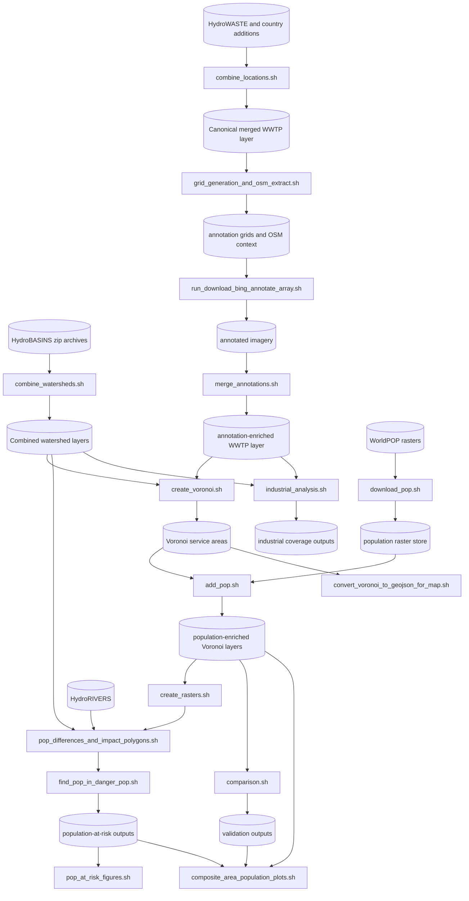

# Global-WWTP-Service-Zones-and-Risk-Pipeline

The repository is a pipeline developed to explore whether AI can fill data gaps regarding Wastewater Treatment Plants (WWTPs) globally, for example the population served and the type of WWTP (residential, industrial, etc.). The core idea is to approximate WWTP service areas via Voronoi tessellations, provided that WWTP coverage is adequate enough that cells do not erroneously extend into areas served by uncovered WWTPs absent from the dataset.

WWTPs are not just point infrastructure in this project: they are spatial service units whose catchments can be approximated, refined, and compared against reference datasets. This pipeline is designed to run at multi-country scale and combines correction, harmonization, Voronoi allocation, population attribution, river-linked risk propagation, validation, industrial coverage analysis, and reporting. Most runtime behavior is controlled from `src/config.yaml`, with shell wrappers providing reproducible local and SLURM entry points.

## Table of Contents

- [Data Sources](#data-sources)
- [Approaches](#approaches)
- [Weighted Voronoi Tessellation](#weighted-voronoi-tessellation)
- [Clipping / Buffering](#clipping--buffering)
- [Analyses](#analyses)
- [What This Repository Contains](#what-this-repository-contains)
- [Canonical Script Run Order](#canonical-script-run-order)
- [Project Data Flow](#project-data-flow)
- [Environment Creation](#environment-creation)
- [Starter Data Files You Need Before Running](#starter-data-files-you-need-before-running)
- [Configuration Parameters You Usually Need To Change](#configuration-parameters-you-usually-need-to-change)
- [What Is Missing Or External To The Repository](#what-is-missing-or-external-to-the-repository)
- [Section Documentation](#section-documentation)

## Data Sources

### Primary WWTP Dataset: HydroWASTE
HydroWASTE is a spatially explicit global database of 58,502 WWTPs and their characteristics, developed by combining national and regional datasets with auxiliary information to derive or complete missing attributes including population served, effluent flow rate, and treatment level.

Reference:
Ehalt Macedo, H., Lehner, B., Nicell, J., Grill, G., Li, J., Limtong, A., Shakya, R. (2022). Distribution and characteristics of wastewater treatment plants within the global river network. Earth System Science Data, 14(2): 559-577. https://doi.org/10.5194/essd-14-559-2022

A drawback of HydroWASTE is that some points represent the discharge location rather than the WWTP itself. To address this, the repository uses a pre-corrected file configured as `correct_locations_w_OSM.paths.paul_corrected_filepath` in `src/config.yaml`.

The remaining locations are scanned in OpenStreetMap within a 5 km radius (`correct_locations_w_OSM.rad = 5000`). OSM geometry is assigned if found, otherwise the location is discarded.

### European Dataset: Waterbase-UWWTD
A similar location-correction approach is applied to the European dataset. The Waterbase-UWWTD (Urban Waste Water Treatment Directive) dataset, provided by the European Environment Agency (EEA), includes data on individual WWTPs and collecting systems: their localisation, capacity and actual load treated, type of treatment, and aggregated performance data.

Reference:
European Environment Agency. Waterbase - UWWTD: Urban Waste Water Treatment Directive - reported data. https://www.eea.europa.eu/data-and-maps/data/waterbase-uwwtd-urban-waste-water-treatment-directive

Extra points were also added for the United States, Canada, Germany, and Thailand.

### Watershed Basins: HydroBASINS / HydroSHEDS
Using Voronoi tessellation alone does not account for river topology. It is costly to transport water across different watersheds, so WWTPs are assigned to watershed basins before analysis.

HydroSHEDS is a mapping product providing hydrographic information for regional and global-scale applications in a consistent format, offering geo-referenced datasets at various scales including river networks, watershed boundaries, drainage directions, and flow accumulations; it is based on elevation data obtained in 2000 by NASA's Shuttle Radar Topography Mission (SRTM). HydroBASINS provides polygons of nested, hierarchical watersheds ranging from level 1 to level 12, using Pfafstetter codes.

Reference:
Lehner, B., Grill, G. (2013). Global river hydrography and network routing: baseline data and new approaches to study the world's large river systems. Hydrological Processes, 27(15): 2171-2186. https://doi.org/10.1002/hyp.9740

HydroBASINS Technical Documentation:
https://data.hydrosheds.org/file/technical-documentation/HydroBASINS_TechDoc_v1c.pdf

HydroBASIN zip files for a level `X` should be placed under `data/hydroshed_river_levels/lvl{X}`. The level is a free parameter: higher levels group more WWTPs together, while lower levels increase individual differences and reduce inter-WWTP interaction.

### Population Data: WorldPOP
WorldPOP 100 m rasters from 2014 to 2024 are downloaded and saved per country. Each Voronoi cell is intersected with the raster to obtain population estimates.

## Approaches

Three approaches are implemented. In all cases, Voronoi cells are created for each buffer and set of points individually.

- Approach 1 builds buffers around WWTPs, then groups and dissolves intersecting buffers. The dissolved buffer serves as the basin for the WWTPs therein.
- Approach 2 groups WWTPs based on a buffer layer, in this repository watershed boundaries from HydroBASINS.
- Approach 3 groups WWTPs based on city identification. Cities are buffered; the population inside is divided among WWTPs within using Voronoi cells. It exists in the codebase but is not the main production path.

Although the present application is wastewater infrastructure, the methodological structure is not specific to WWTPs. The framework can be transferred to other infrastructure domains whenever the analytical problem is to approximate a service area, allocate an exposed or served population, and compare competing facilities under spatial constraints. In practical terms, such a transfer usually requires changing five elements rather than redesigning the whole pipeline: the point layer representing service-providing sites, the boundary or grouping layer that constrains plausible service exchange, the weighting proxy that represents relative service capacity or attractiveness, the population or exposure surface being allocated, and the validation dataset used to assess realism.

For example, the same workflow could be adapted to hospitals, schools, health posts, fire stations, solid-waste facilities, warehouses, or other distributed service infrastructure. In a healthcare setting, WWTP points would be replaced by hospital or clinic locations, watershed boundaries could be replaced by administrative regions, catchments, travel sheds, or road-constrained service zones, and the weighting term could be derived from bed count, staffing, floor area, or treatment capacity instead of lagoon area or pond count. In an education setting, facilities could be schools, the population surface could be school-age population rather than total population, and validation could be performed against enrolment or district planning data. The same logic applies to emergency response, logistics, and other networked public-service systems: the geometry engine remains similar, while the domain-specific meaning of sites, constraints, and weights changes.

The important methodological point is that the repository separates the generic allocation machinery from the domain-specific inputs. The Voronoi engine, buffering logic, weighting transforms, and downstream population intersection are reusable components; what changes from one application to another is the interpretation of the inputs and the choice of constraint layer. This is why the repository exposes configurable hooks such as `create_voronoi.calculate_area_fn`, `create_voronoi.calculate_buffer_fn`, and `create_voronoi.prepare_data_fn`: they allow the same spatial allocation framework to be retuned for alternative service systems without rewriting the core geometry pipeline.

## Weighted Voronoi Tessellation

Standard Voronoi tessellation treats all locations equally, which does not reflect real differences between WWTPs. A custom weighted distance function is implemented. The code creates an xy-plane with resolution `n_steps` meters between points and checks which area of influence each point falls into.

Three distance functions are available:
- Euclidean distance.
- Multiplicative Euclidean.
- Additive Euclidean.

Weights are normalized within each buffer and computed from ML-derived tags such as the number of ponds and total treatment pond area, combined as `total_area * sqrt(number_of_ponds)`.

Weight transformation functions are controlled by `create_voronoi.weight_method` and currently supported values are:
- `linear`
- `square_root`
- `logarithmic`
- `sigmoid`

## Clipping / Buffering

To avoid disproportionately large Voronoi cells, especially in sparse areas, cells are clipped to a buffer around each location after creation.

- Static buffering: disable dynamic buffering with `create_voronoi.dynamic_buffering: false`. The positional `buffer` argument overrides the config value at runtime.
- Dynamic buffering: enable with `create_voronoi.dynamic_buffering: true`. The scale factor is `create_voronoi.dynamic_buffer_k`.

The sweep analysis scripts support sensitivity analysis across combinations of model parameters. The configurable hooks that govern those runs are `create_voronoi.calculate_area_fn`, `create_voronoi.calculate_buffer_fn`, and `create_voronoi.prepare_data_fn`, which are resolved at runtime through `src/pipelines.py`.

## Analyses

### Population Validation
Calculated population estimates are compared against HydroWASTE, using only locations where `QUAL_POP == 1` from official sources, and against European Waterbase-UWWTD data, which reports Population Equivalent rather than actual observed population.

Three validation tiers are differentiated:
- Basins with a single WWTP.
- Basins with multiple sources where at least a threshold fraction of plants appear in both datasets.
- Basins with multiple sources regardless of threshold coverage.

For both datasets, a Normalized Difference Index and a linear regression are produced.

### Population at Risk
This branch propagates organic material from unserved settlements downstream.

The workflow identifies non-served population outside WWTP service areas, assigns river segments to basins, links non-served polygons to nearby rivers, propagates organic load downstream until concentration falls below `impact_polygons_pop_params.c_limit`, and then intersects the resulting impact corridors with WorldPOP.

### Industrial Area Analysis
For this analysis, a 10 m industrial land dataset from Zenodo is downloaded and vectorized. Industrial areas are assigned to watersheds and compared against Voronoi coverage generated from industrial WWTPs selected through the annotation-derived category fields. Industrial areas not served by any such WWTP are identified and reported.

The remaining sections shift from method to use: they first show how the repository is organised, then outline the standard execution order and end-to-end data flow, and finally summarise the setup and configuration details needed to run the workflow.

## What This Repository Contains

The repository is organized around one canonical processing chain and several optional analysis or reporting branches.

| Area | Location | Purpose |
| --- | --- | --- |
| Runtime configuration | `src/config.yaml` | Global parameter and path control |
| Config resolver | `src/starter.py` | Resolves inherited config values and positional overrides |
| Main technical index | `src/README.md` | Stage index and cross-stage settings |
| Merge stage | `src/data_merge/` | Build the canonical WWTP dataset |
| Annotation stage | `src/annotation_scripts/` | Generate grids, OSM context, and annotation merges |
| Voronoi stage | `src/create_voronoi.py`, `src/create_voronoi.sh` | Create service areas |
| Population stage | `src/add_pop.py`, `src/add_pop.sh` | Attach WorldPOP counts to service areas |
| Risk stage | `src/pop_at_risk_river_calculations/` | Compute non-served population and downstream risk |
| Validation stage | `src/pop_validation_scripts/` | Compare outputs against HydroWASTE and Waterbase-UWWTD |
| Industrial stage | `src/industrial_analysis/` | Measure industrial land not covered by eligible WWTPs |
| Figures stage | `src/figures_scripts/` | Build maps, plots, and publication outputs |
| Sweep stage | `src/sensitivity_analysis_scripts/` | Run parameter sweeps and compare results |

Each major processing directory has its own README that explains the role of the stage, the purpose of each script, the local data flow, and the configuration settings that matter for that part of the pipeline.

## Canonical Script Run Order

The standard end-to-end order is the following.

1. `src/data_merge/combine_locations.sh`
2. `src/combine_watersheds.sh`
3. `src/annotation_scripts/grid_generation_and_osm_extract.sh`
4. `src/annotation_scripts/run_download_bing_annotate_array.sh`
5. `src/annotation_scripts/merge_annotations.sh`
6. `src/download_pop.sh`
7. `src/create_voronoi.sh`
8. `src/add_pop.sh`
9. `src/pop_at_risk_river_calculations/create_rasters.sh`
10. `src/pop_at_risk_river_calculations/pop_differences_and_impact_polygons.sh`
11. `src/pop_at_risk_river_calculations/find_pop_in_danger_pop.sh`
12. `src/pop_validation_scripts/comparison.sh`
13. `src/industrial_analysis/industrial_analysis.sh`
14. `src/figures_scripts/convert_voronoi_to_geojson_for_map.sh`
15. `src/figures_scripts/composite_area_population_plots.sh`
16. `src/figures_scripts/pop_at_risk_figures.sh`

The sensitivity-analysis launchers under `src/sensitivity_analysis_scripts/` are optional and sit outside the canonical production run.

## Project Data Flow



## Environment Creation

The Python package metadata lives in `src/pyproject.toml`. A minimal local environment can be created from the repository root.

### PowerShell
```powershell
python -m venv .venv
.\.venv\Scripts\Activate.ps1
python -m pip install --upgrade pip
python -m pip install -e ./src
```

### Bash
```bash
python -m venv .venv
source .venv/bin/activate
python -m pip install --upgrade pip
python -m pip install -e ./src
```

To install the test dependencies as well:

```bash
python -m pip install -e "./src[test]"
```

Practical prerequisites:
- Python 3.9 or newer.
- A shell that can run the repository wrappers. Most canonical entry points are `.sh` launchers.
- Access to the geospatial inputs under `data/`.
- Optional SLURM access if you intend to use the cluster-oriented wrappers.

## Starter Data Files You Need Before Running

The pipeline relies on input data artifacts. Without these files or their configured equivalents, the workflow cannot complete.

| Data file or directory | Consumed by | Status in this workspace |
| --- | --- | --- |
| `data/Enhanced_HW_WWTP__jun20_2025.geojson` | geometry correction and merge bootstrap | present |
| `data/wastewater_plant.geojson` | OSM-based location correction | present |
| `data/DL_results/csvv2-2.zip` | legacy segmentation merge (`--variant old`) | present |
| `data/DL_results/aftersort.geojson` | legacy segmentation index mapping | present |
| `data/extra_points/Canada_14_03_2025.csv` | final merge enrichment | present |
| `data/extra_points/Germany_Hydra_waste_geospatial_corrected.geojson` | final merge enrichment | present |
| `data/final_data_source/final_W_europe_WWT_dec3.geojson` | final merge enrichment | present |
| `data/final_data_source/Thailand_500m_merged.geojson` | final merge enrichment | present |
| `data/final_data_source/final_USA_WWT_dec3.geojson` (or another file set in `final_data_merge.paths.us_new_filepath`) | final merge enrichment | missing at default path |
| `data/hydroshed_river_levels/lvl{level}/` | watershed combination (`combine_watersheds`) | missing for default `level=7` |
| `data/cleaned_hydrowaste.csv` | weighted Voronoi input features | present |
| `data/bboxes.csv` | weighted Voronoi support table | present |
| `data/cities.csv` | optional city-based Voronoi approach | present |
| `data/hydrorivers.gpkg` | river assignment and downstream risk chain | missing |
| `data/extra_points/UWWTD_TreatmentPlants.gpkg` | EU validation comparison | present |
| `data/boundaries/ne_110m_admin_0_countries.shp` (+ sidecars) | figures and country overlays | present |

In addition, two canonical defaults point to external cluster paths and must usually be overridden locally:
- `merge_seg_results.paths.seg_results_filepath`
- `download_bing_annotate.paths.annotations_images_dir` (and related annotation-output paths)

If you only need to read or modify execution settings, start with `src/config.yaml` and `src/README.md`. The shell launchers orchestrate execution, but the pipeline dependencies are the data files above.

## Configuration Parameters You Usually Need To Change

The defaults are a mix of portable relative paths and environment-specific cluster paths. Before a local run, check at least the following keys.

| Config key | Why you may need to change it |
| --- | --- |
| `merge_seg_results.paths.seg_results_filepath` | Defaults to a cluster-only segmentation CSV path |
| `download_bing_annotate.paths.annotations_images_dir` | Defaults to a cluster-only imagery directory |
| `download_bing_annotate.paths.annotated_images_output_dir` | Defaults to a cluster-only annotated-image directory |
| `merge_annotations.paths.annotations_results_filepath` | Defaults to a cluster-only annotation results CSV |
| `annotations_inspection.paths.annotations_verf_image_outpath_dir` | Defaults to a cluster-only QA output directory |
| `correct_locations_w_OSM.paths.paul_corrected_filepath` | Must point to the corrected HydroWASTE source you actually have |
| `combine_watersheds.paths.watersheds_zip_dir` | Must match where the HydroBASINS zip files were placed |
| `create_voronoi.level` | Controls HydroBASINS granularity |
| `create_voronoi.buffer` | Controls static clip radius when dynamic buffering is off |
| `create_voronoi.weight_method` | Controls weight transformation |
| `create_voronoi.weight_func` | Controls multiplicative vs additive weighted distance |
| `create_voronoi.dynamic_buffering` | Switches between static and dynamic clipping |
| `create_voronoi.dynamic_buffer_k` | Controls dynamic buffer scaling |
| `create_rasters.zoom_level` | Controls raster/tile resolution used in the risk workflow |
| `find_unserved_pop.figures.pop_threshold` | Controls thresholding of non-served population polygons |
| `find_intersection_river.x_distance` | Controls maximum river-match distance for non-served polygons |
| `impact_polygons_pop.impact_polygons_pop_params.*` | Controls downstream organic-load propagation |
| `find_unconnected_industrial_areas.industrial_category_numbers` | Controls which annotation categories are treated as industrial WWTPs |

`src/starter.py` resolves values in canonical YAML order. Earlier sections define shared values and later sections inherit them with `null`. Positional CLI overrides always take precedence over the resolved config.

The canonical shared override order used across the wrappers is:

```bash
[level] [version] [buffer] [weight_method] [weight_func] [dynamic_buffering] [dynamic_buffer_k]
```

## What Is Missing Or External To The Repository

The repository is not fully self-contained. Several required inputs are expected to exist outside the code.

- Satellite imagery for annotation is not downloaded by the repository wrappers; the code expects an existing image directory.
- Annotation inference CSV outputs are treated as external inputs to the merge-back stage.
- Some default paths in `src/config.yaml` point to cluster-local storage and must be replaced for local execution.
- HydroBASINS zip archives must be placed manually under `data/hydroshed_river_levels/lvl{level}` before watershed combination.
- The corrected HydroWASTE source referenced by `correct_locations_w_OSM.paths.paul_corrected_filepath` is used by the pipeline, but the publication metadata for that correction source is not embedded in the repository.
- River matching distance is configurable via `find_intersection_river.x_distance` (default 5000 m).

## Section Documentation

The section READMEs under `src/` are the detailed reference documents for each stage.

| Section | Detailed documentation |
| --- | --- |
| `src/` technical index | `src/README.md` |
| Data merge | `src/data_merge/README.md` |
| Annotation | `src/annotation_scripts/README.md` |
| Population and river-risk calculations | `src/pop_at_risk_river_calculations/README.md` |
| Validation | `src/pop_validation_scripts/README.md` |
| Figures and exports | `src/figures_scripts/README.md` |
| Industrial analysis | `src/industrial_analysis/README.md` |
| Sensitivity analysis | `src/sensitivity_analysis_scripts/README.md` |
