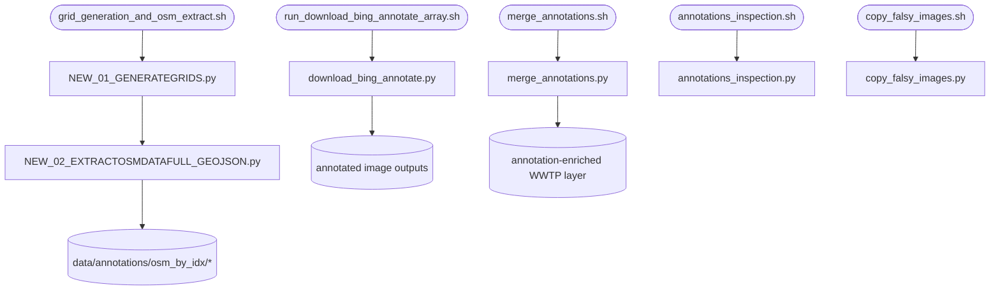

# annotation_scripts

## Sections
| Section | Purpose |
| --- | --- |
| `What This Module Does` | Explains the aim of the annotation stage |
| `How It Fits In` | Shows where this stage sits in the wider workflow |
| `Scripts in This Folder` | Summarises the role, inputs, and outputs of each script |
| `Execution Flow` | Gives a compact visual view of the stage |
| `Run Instructions` | Lists the commands most users will actually run |
| `Smart Behaviors` | Notes implementation details that matter in practice |
| `Parameters` | Collects the configuration settings specific to this stage |
| `Known Issues / TODOs` | Flags current caveats and limitations |

## What This Module Does
This module prepares and merges annotation context around WWTP points. It creates grids, extracts OSM features, renders annotation imagery, and then merges the annotation results back into the corrected WWTP dataset.

## How It Fits In
It runs after the main WWTP merge and before the Voronoi and population stages when annotation-derived context is needed. Its outputs are used for QA, downstream filtering, and explanation of WWTP type labels.

## Required Starter Data Files

Before running this stage, these inputs must be available.

| Data file | Why needed | Default path status |
| --- | --- | --- |
| Corrected and merged WWTP layer | points for grid generation | produced by `data_merge/combine_locations.sh` |
| Satellite imagery directory | source for annotation download | `download_bing_annotate.paths.annotations_images_dir` (cluster-specific path by default) |
| Annotation inference results | CSV with AI labels for merge-back | `merge_annotations.paths.annotations_results_filepath` (cluster-specific path by default) |

Cluster-specific defaults for imagery and annotation outputs must be overridden in `src/config.yaml` for local execution. See `download_bing_annotate.paths.*` and `merge_annotations.paths.*` in config.

## Scripts in This Folder
| Script | Role | What it does | Key inputs | Key outputs |
| --- | --- | --- | --- | --- |
| `grid_generation_and_osm_extract.sh` | shell launcher | Runs grid generation and OSM extraction in sequence | config values and positional overrides | grid files and OSM context files |
| `NEW_01_GENERATEGRIDS.py` | Python worker | Builds annotation grids around corrected WWTP points | corrected WWTP layer, grid parameters | grid GeoPackages |
| `NEW_02_EXTRACTOSMDATAFULL_GEOJSON.py` | Python worker | Extracts OSM context for each grid | grid files, OSM settings, retries | per-grid OSM GeoJSON |
| `run_download_bing_annotate_array.sh` | shell launcher | Launches image rendering as a SLURM array | array task id, split seed, config overrides | per-task logs and annotated images |
| `download_bing_annotate.py` | Python worker | Downloads imagery and creates annotation overlays | imagery directory, OSM context, tile ids | annotated image assets |
| `merge_annotations.sh` | shell launcher | Runs the merge-back stage | config values and positional overrides | merge logs and updated corrected-all file |
| `merge_annotations.py` | Python worker | Parses annotation text and merges labels into WWTP points | annotation CSV, annotated images, corrected layer | updated corrected-all GeoPackage |
| `annotations_inspection.sh` | shell launcher | Runs QA sampling and inspection | config values and positional overrides | QA logs and review images |
| `annotations_inspection.py` | Python worker | Builds class summaries and inspection samples | annotated images and annotation results | QA sample set |
| `copy_falsy_images.sh` | shell launcher | Copies selected images for review | config values and positional overrides | copied review images |
| `copy_falsy_images.py` | Python worker | Copies a filtered image subset for QA | annotated images and selection criteria | copied image subset |
| `NEW_03_WASTEWATERJOIN_GEOJSON.py` | Python worker | Optional join helper for GeoJSON/parquet intermediates | OSM outputs and temp parquet files | joined geodata |
| `NEW_04_EXPORTGEOTIFF.py` | Python worker | Optional geotiff export helper | prepared geospatial layers | GeoTIFF outputs |

## Execution Flow


## Run Instructions
### Core flow
```bash
cd src
bash annotation_scripts/grid_generation_and_osm_extract.sh
sbatch annotation_scripts/run_download_bing_annotate_array.sh
bash annotation_scripts/merge_annotations.sh
```

### QA utilities
```bash
cd src
bash annotation_scripts/annotations_inspection.sh
bash annotation_scripts/copy_falsy_images.sh
```

A successful run produces grid files, OSM GeoJSON, annotated images, and a merged corrected-all file. The QA scripts write sampled review outputs and logs under `logs/`.

## Smart Behaviors
- `annotations_inspection.py` uses `annotations.n_sample_size` with a default fallback of `1000` and saves figures in headless runs instead of relying on an interactive display.
- `merge_annotations.py` parses the image index defensively from filenames and drops any existing annotation columns before re-merging to avoid duplicate `_x`/`_y` columns.
- `download_bing_annotate.py` reads `annotations_images_dir` and `annotated_images_output_dir` from config, so local imagery paths can be swapped without touching code.
- The SLURM array wrapper partitions rendering work by array task and split seed.

Delete the grid, annotation, or merged outputs to force a rerun of the corresponding stage.

## Parameters
| Config key | Default | Effect |
| --- | --- | --- |
| `NEW_01_GENERATEGRIDS.annotations.cell_size` | `3072` | Grid cell size |
| `NEW_01_GENERATEGRIDS.annotations.factor` | `1.194` | Grid expansion factor |
| `NEW_02_EXTRACTOSMDATAFULL_GEOJSON.annotations.max_workers` | `8` | OSM query parallelism |
| `NEW_02_EXTRACTOSMDATAFULL_GEOJSON.annotations.overwrite` | `false` | Overwrite existing OSM outputs |
| `NEW_02_EXTRACTOSMDATAFULL_GEOJSON.annotations.retries` | `5` | OSM retry count |
| `NEW_02_EXTRACTOSMDATAFULL_GEOJSON.annotations.overpass_urls` | list | Rotating Overpass endpoint list |
| `NEW_02_EXTRACTOSMDATAFULL_GEOJSON.annotations.overpass_pause_seconds` | `0.1` | Pause between task-batch submissions |
| `annotations_inspection.annotations.n_sample_size` | `1000` | QA sample size |
| `annotations_inspection.annotations.random_seed` | `42` | QA sampling seed |
| `download_bing_annotate.annotations.zoom_level` | `17` | Imagery zoom level |
| `download_bing_annotate.annotations.image_size_px` | `3072` | Requested imagery width/height in pixels |
| `download_bing_annotate.annotations.max_workers` | `64` | Parallel bbox annotation worker count |
| `download_bing_annotate.annotations.request_timeout_seconds` | `15` | HTTP timeout for imagery downloads |
| `download_bing_annotate.annotations.random_image_rgb` | `[0,0,0]` | Fill color used by random-image fallback |
| `download_bing_annotate.annotations.georeferenced` | `false` | Write georeferenced GeoTIFF output instead of resized PNG |
| `download_bing_annotate.annotations.fontsize` | `24` | Label font size in rendered outputs |
| `download_bing_annotate.annotations.dpi` | `72` | PNG save DPI |
| `download_bing_annotate.annotations.target_size_px` | `1024` | Final PNG output width/height |
| `download_bing_annotate.annotations.bing_imagery_url` | Bing endpoint | Base URL for imagery requests |
| `download_bing_annotate.annotations.earth_radius_m` | `6378137` | Earth radius used for Mercator math |
| `download_bing_annotate.annotations.mercator_tile_size_px` | `256` | Web-Mercator base tile size |
| `download_bing_annotate.annotations.imagery_reference_tile_size_px` | `512` | Imagery provider native tile size used in pixel scaling |
| `download_bing_annotate.paths.annotations_images_dir` | ⚠️ path | Source imagery directory |
| `download_bing_annotate.paths.annotated_images_output_dir` | ⚠️ path | Annotated image output directory |
| `merge_annotations.paths.annotations_results_filepath` | ⚠️ path | Annotation results CSV |
| `annotations_inspection.paths.annotations_verf_image_outpath_dir` | ⚠️ path | QA image output directory |

## Known Issues / TODOs
- `NEW_03_WASTEWATERJOIN_GEOJSON.py` and `NEW_04_EXPORTGEOTIFF.py` exist as optional helpers but are not part of the primary shell chain.
- No explicit `TODO` or `FIXME` markers were found in this module.
