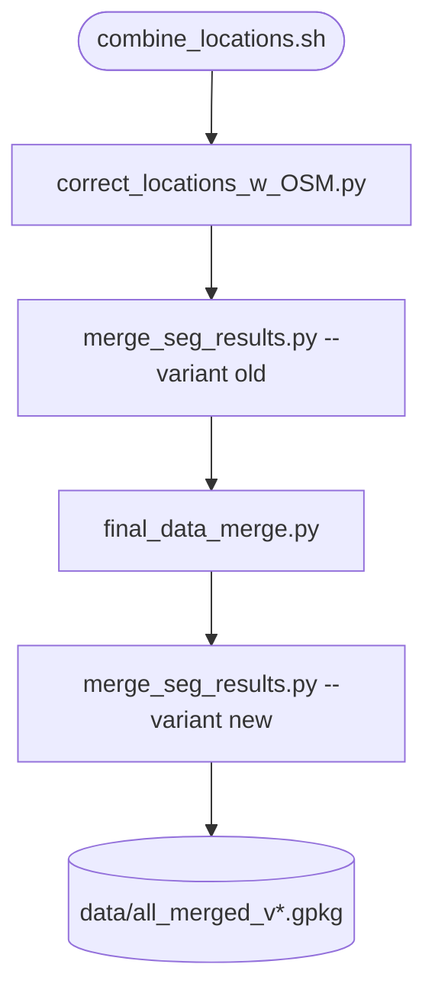

# data_merge

## Sections
| Section | Purpose |
| --- | --- |
| `What This Module Does` | Explains the aim of the merge stage |
| `How It Fits In` | Shows where this stage sits in the overall workflow |
| `Scripts in This Folder` | Summarises the role, inputs, and outputs of each script |
| `Execution Flow` | Gives a compact visual view of the merge chain |
| `Run Instructions` | Lists the commands most users will actually run |
| `Smart Behaviors` | Notes practical details about merge logic and reruns |
| `Parameters` | Collects the configuration settings specific to this stage |
| `Known Issues / TODOs` | Flags current caveats and limitations |

## What This Module Does
This module builds the canonical WWTP point dataset used by the rest of the pipeline. It combines OSM-based geometry correction, segmentation integration, and the final multi-source merge into one reproducible chain.

## How It Fits In
It is the first blocking stage after raw source collection. Its outputs feed Voronoi creation, population attachment, validation, industrial analysis, and all downstream reporting.

## Scripts in This Folder
| Script | Role | What it does | Key inputs | Key outputs |
| --- | --- | --- | --- | --- |
| `combine_locations.sh` | shell launcher | Runs the full merge chain in order | config values and positional overrides | logs plus the final merged WWTP dataset |
| `correct_locations_w_OSM.py` | Python worker | Corrects WWTP geometries using OSM and corrected-source fallback | HydroWASTE, OSM geometry, Overture cache, radius | corrected point layer |
| `merge_seg_results.py` | Python worker | Merges segmentation outputs into corrected points | segmentation CSV, corrected layers, legacy flag | segmentation-enriched layer(s) |
| `final_data_merge.py` | Python worker | Produces the canonical merged WWTP layer | corrected sources and country-specific files | `all_merged_v*.gpkg` |

## Execution Flow


## Run Instructions
### Local
```bash
cd src
bash data_merge/combine_locations.sh
```

### HPC
```bash
cd src
sbatch data_merge/combine_locations.sh
```

### With overrides
```bash
cd src
bash data_merge/combine_locations.sh 7 2 9000 logarithmic mult true 0.5
```

A successful run updates the corrected and merged GeoPackages and writes logs under `logs/combine_locations.log` and `logs/merge_seg_results.log`.

## Smart Behaviors
- `combine_locations.sh` always runs the merge chain in a fixed order.
- `merge_seg_results.py` uses `legacy_merge` to decide whether the old segmentation branch should run.
- `final_data_merge.py` starts from the configured merged baseline and selects the corrected or segmentation-corrected source based on `legacy_merge`.
- The segmentation input path is cluster-specific in `src/config.yaml`, so this stage often needs a local override.

Delete the final merged GeoPackage and rerun the launcher to force a full rebuild.

## Parameters
| Config key | Default | Effect |
| --- | --- | --- |
| `correct_locations_w_OSM.rad` | `5000` | OSM search radius for geometry correction |
| `merge_seg_results.legacy_merge` | `true` | Enables the legacy segmentation merge branch |
| `final_data_merge.threshold` | `500` | Merge threshold |
| `final_data_merge.osm_threshold` | `1000` | OSM threshold for merge logic |
| `correct_locations_w_OSM.paths.paul_corrected_filepath` | template | Pre-corrected HydroWASTE source |
| `merge_seg_results.paths.seg_results_filepath` | ⚠️ path | Segmentation CSV input |
| `final_data_merge.paths.canada_filepath` | template | Canada source file |
| `final_data_merge.paths.germany_filepath` | template | Germany source file |
| `final_data_merge.paths.us_new_filepath` | template | US source file |
| `final_data_merge.paths.eu_new_filepath` | template | Europe source file |
| `final_data_merge.paths.thailand_filepath` | template | Thailand source file |

## Known Issues / TODOs
- No explicit `TODO` or `FIXME` markers were found in this module.
- `merge_seg_results.paths.seg_results_filepath` is hard-coded to a cluster path in the default config and should be overridden locally.
