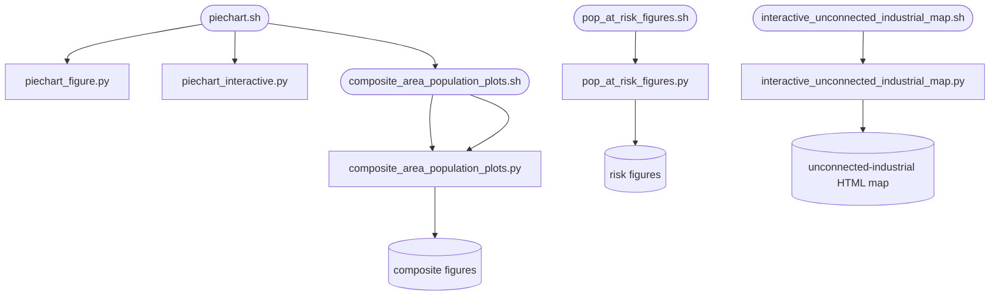

# figures_scripts

## Sections
| Section | Purpose |
| --- | --- |
| `What This Module Does` | Explains the aim of the reporting and export stage |
| `How It Fits In` | Shows where this stage sits in the full workflow |
| `Scripts in This Folder` | Summarises the role, inputs, and outputs of each script |
| `Execution Flow` | Gives a compact visual view of the reporting workflow |
| `Run Instructions` | Lists the commands most users will actually run |
| `Smart Behaviors` | Notes practical details about reuse and reruns |
| `Parameters` | Collects the configuration settings specific to this stage |
| `Known Issues / TODOs` | Flags current caveats and limitations |

## What This Module Does
This module turns pipeline outputs into communication-ready products. It creates figures, plots, pie charts, and map-ready exports from already processed geospatial data.

## How It Fits In
It runs near the end of the pipeline. Its inputs come from the population, risk, validation, and Voronoi stages, and its outputs are the charts and map layers used for review or publication.

## Required Starter Data Files

Before running this stage, these outputs from prior stages must exist.

| Data file | Why needed | Default path status |
| --- | --- | --- |
| Population-enriched Voronoi outputs | core layer for map export and plots | produced by `add_pop.sh` |
| Risk calculation outputs | at-risk population and impact polygons | produced by `pop_at_risk_river_calculations/` stage |
| Validation results | comparison summaries for reporting | produced by `pop_validation_scripts/` |
| Country boundaries | spatial overlays for composite plots | `data/boundaries/ne_110m_admin_0_countries.shp` (present) |
| Raster country statistics | WWTP type summaries for pie charts | produced by `create_rasters.py` |

## Scripts in This Folder
| Script | Role | What it does | Key inputs | Key outputs |
| --- | --- | --- | --- | --- |
| `piechart.sh` | shell launcher | Runs static, interactive, and sizes map pie/HTML workflows | config values and named `--level`/`--version`/... overrides | PNG/HTML/GeoJSON outputs |
| `composite_area_population_plots.sh` | shell launcher | Runs the composite plotting workflow | config values and named `--level`/`--version`/... overrides | histogram and scatter PNGs |
| `composite_area_population_plots.py` | Python worker | Builds area/population composite plots | pop-Voronoi outputs and country boundaries | diagnostic figures |
| `piechart_figure.py` | Python worker | Builds a static pie-chart summary figure | raster-country stats and country boundaries | PNG summary figure |
| `piechart_interactive.py` | Python worker | Builds an interactive pie-chart HTML map | raster-country stats and country boundaries | interactive HTML output |
| `sizes_interactive_map.py` | Python worker | Creates reduced centroid GeoJSON and versioned sizes interactive HTML | population-enriched Voronoi outputs and template HTML | map-ready GeoJSON and standalone HTML |
| `pop_at_risk_figures.sh` | shell launcher | Runs the risk-figure workflow | config values and named `--level`/`--version`/... overrides | risk figures and logs |
| `pop_at_risk_figures.py` | Python worker | Plots population-at-risk and impact summaries | risk outputs and tile overlays | risk-analysis figures |
| `interactive_unconnected_industrial_map.sh` | shell launcher | Runs the unconnected-industrial map workflow | config values and named overrides | interactive HTML map and logs |
| `interactive_unconnected_industrial_map.py` | Python worker | Builds a Folium map of industrial areas with no nearby WWTP | unconnected-industrial layer from `industrial_analysis/` | standalone HTML map |
| `_shared.py` | shared helpers | Figure-layer column conventions used by both piechart scripts: `aggregate_by_country`, `calculate_size`, `ensure_population_percentage_column` | - | - |

## Execution Flow


## Run Instructions
### Common reporting run
```bash
cd src
bash figures_scripts/piechart.sh sizes
bash figures_scripts/composite_area_population_plots.sh
bash figures_scripts/pop_at_risk_figures.sh
```

### Interactive map or pie charts
```bash
cd src
python -m src.figures_scripts.piechart_figure
python -m src.figures_scripts.piechart_interactive
python -m src.figures_scripts.sizes_interactive_map
python -m src.figures_scripts.interactive_unconnected_industrial_map
```

### HPC
```bash
cd src
sbatch figures_scripts/composite_area_population_plots.sh
sbatch figures_scripts/pop_at_risk_figures.sh
```

A successful run produces PNG, HTML, and GeoJSON outputs under `data/figures/...`.

## Smart Behaviors
- Figure scripts consume existing outputs and do not retrigger heavy upstream pipeline stages.
- The sizes interactive workflow isolates reduced GeoJSON export from heavy plotting logic so it can be rerun cheaply.
- The composite plotting script reads the configured default zonal-sum column and can fall back when the preferred year-specific column is absent.

Delete the corresponding figure output directory to force a rerun.

## Parameters
| Config key | Default | Effect |
| --- | --- | --- |
| `sizes_interactive_map.figures.approach` | null | Sizes map export approach selector |
| `composite_area_population_plots.zonal_sum_default_column` | `2024_zonal_sum` | Preferred zonal-sum column |
| `composite_area_population_plots.paths.country_boundaries_filepath` | template | Country boundary input |
| `piechart_figure.industrial_category_numbers` | null | Industrial category filter |
| `piechart_figure.min_total_size` | `50000000` | Minimum summed area threshold per country |
| `piechart_interactive.industrial_category_numbers` | null | Industrial category filter |
| `piechart_interactive.min_total_size` | `50000000` | Minimum summed area threshold per country |
| `pop_at_risk_figures.zoom_level` | null | Risk figure tile zoom level |
| `pop_at_risk_figures.save_dpi` | `1000` | Export DPI for saved risk figures |
| `pop_at_risk_figures.paths.figures_dir` | template | Figure output directory |
| `pop_at_risk_figures.paths.non_served_outpath` | null | Non-served area input |
| `pop_at_risk_figures.paths.pop_at_risk_output_filepath` | null | At-risk parquet input |

## Known Issues / TODOs
- `piechart_figure.py` and `piechart_interactive.py` are direct modules rather than being launched by shell wrappers.
- The two piechart scripts deliberately keep different size mappings (log vs linear) and different aggregation depth; the divergence is parameterised in `_shared.py` rather than duplicated.
- No explicit `TODO` or `FIXME` markers were found in this module.
