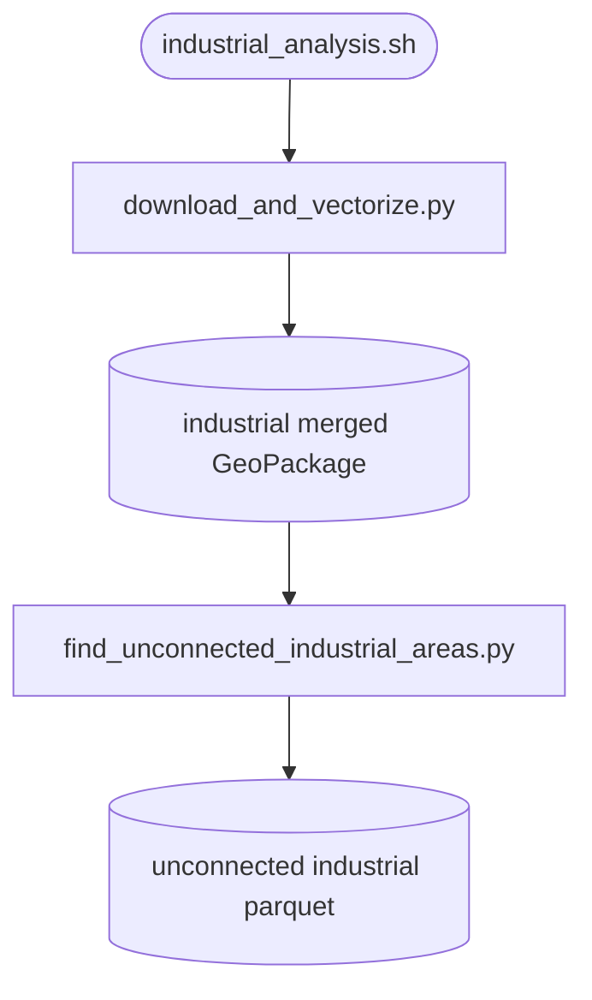

# industrial_analysis

## Sections
| Section | Purpose |
| --- | --- |
| `What This Module Does` | Explains the aim of the industrial-analysis branch |
| `How It Fits In` | Shows where this stage sits in the full workflow |
| `Scripts in This Folder` | Summarises the role, inputs, and outputs of each script |
| `Execution Flow` | Gives a compact visual view of the industrial workflow |
| `Run Instructions` | Lists the commands most users will actually run |
| `Smart Behaviors` | Notes practical details about execution and filtering |
| `Parameters` | Collects the configuration settings specific to this stage |
| `Known Issues / TODOs` | Flags current caveats and limitations |

## What This Module Does
This module measures which industrial land areas are not covered by industrial or mixed WWTP service regions. It downloads and vectorizes industrial land rasters, enriches them with watershed and country context, and then compares them to the industrial-filtered Voronoi outputs.

## How It Fits In
It runs after the main Voronoi and population stages, but it uses the same configurable Voronoi machinery with industrial WWTP categories. Its outputs feed the industrial coverage analysis branch and the reporting layers that summarize uncovered industrial polygons.

## Scripts in This Folder
| Script | Role | What it does | Key inputs | Key outputs |
| --- | --- | --- | --- | --- |
| `industrial_analysis.sh` | shell launcher | Runs the industrial analysis chain | config values and positional overrides | logs plus industrial outputs |
| `download_and_vectorize.py` | Python worker | Downloads and vectorizes industrial raster data | Zenodo archive, basin data, country context | merged industrial GeoPackage |
| `find_unconnected_industrial_areas.py` | Python worker | Finds industrial polygons outside service coverage | industrial polygons, corrected WWTP data, industrial categories | unconnected industrial parquet |

## Execution Flow


## Run Instructions
### Local
```bash
cd src
bash industrial_analysis/industrial_analysis.sh
```

### HPC
```bash
cd src
sbatch industrial_analysis/industrial_analysis.sh
```

A successful run writes the merged industrial layer and the unconnected-industrial parquet, with logs under `logs/industrial_analysis.log`.

## Smart Behaviors
- `download_and_vectorize.py` caches rasters when `industrial_persist_rasters=true` and can reuse the merged industrial GeoPackage when overwrite is disabled.
- `find_unconnected_industrial_areas.py` uses the numeric list in `industrial_category_numbers` to restrict the Voronoi branch to industrial or mixed-use WWTPs.
- Both scripts accept the same positional override layout used by the rest of the pipeline.

Delete the industrial output directory or enable the overwrite flags to force a rerun.

## Parameters
| Config key | Default | Effect |
| --- | --- | --- |
| `download_and_vectorize.industrial_zenodo_url` | Zenodo URL | Industrial raster source |
| `download_and_vectorize.industrial_min_cells` | `100` | Minimum connected raster size |
| `download_and_vectorize.industrial_persist_rasters` | `true` | Preserve downloaded rasters |
| `download_and_vectorize.industrial_simplify_tolerance` | `0.001` | Geometry simplification tolerance |
| `download_and_vectorize.industrial_vectorize_overwrite` | `false` | Overwrite vectorized outputs |
| `find_unconnected_industrial_areas.industrial_category_numbers` | `[]` | Numeric filter for industrial WWTP categories |
| `find_unconnected_industrial_areas.industrial_unconnected_overwrite` | `false` | Overwrite unconnected outputs |
| `find_unconnected_industrial_areas.paths.industrial_unconnected_output` | template | Unconnected industrial parquet |

## Known Issues / TODOs
- No explicit `TODO` or `FIXME` markers were found in this module.
- The default industrial raster URL is external; runs require network access or a prepared local cache.
