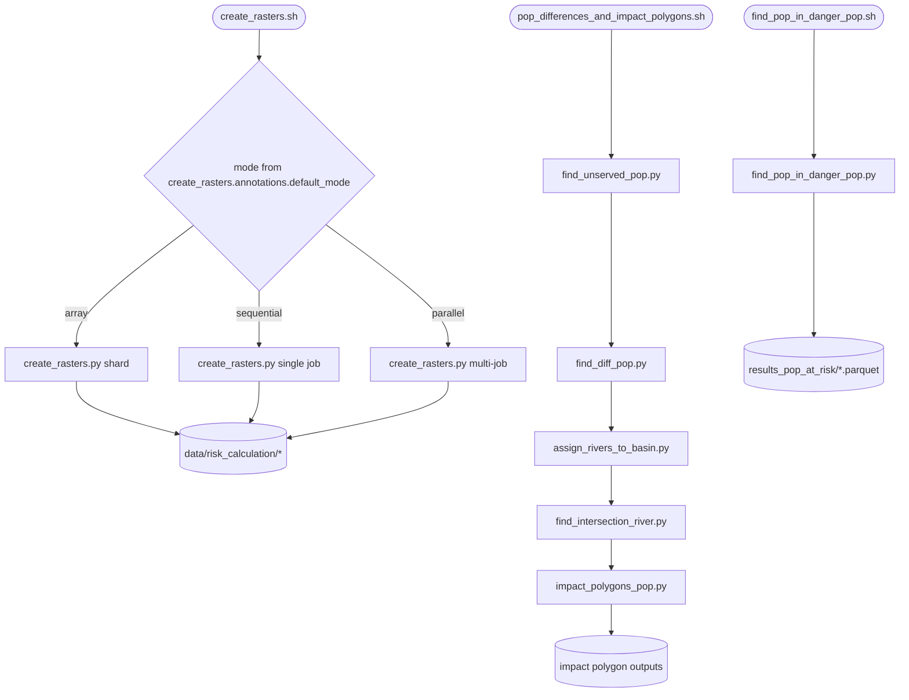

# pop_at_risk_river_calculations

## Sections
| Section | Purpose |
| --- | --- |
| `What This Module Does` | Explains the aim of the downstream-risk stage |
| `How It Fits In` | Shows where this stage sits in the full workflow |
| `Scripts in This Folder` | Summarises the role, inputs, and outputs of each script |
| `Execution Flow` | Gives a compact visual view of the risk workflow |
| `Run Instructions` | Lists the commands most users will actually run |
| `Smart Behaviors` | Notes practical details about execution and modelling choices |
| `Parameters` | Collects the configuration settings specific to this stage |
| `Known Issues / TODOs` | Flags current caveats and limitations |

## What This Module Does
This module computes downstream population risk after Voronoi and population attachment are complete. It identifies non-served population, links those areas to river systems, propagates impact downstream, and aggregates the final at-risk results.

## How It Fits In
It runs after the population-enriched Voronoi stage. Its inputs come from the Voronoi outputs, WorldPOP rasters, watershed layers, and HydroRIVERS data, and its outputs feed the risk figures and reporting stages.

## Scripts in This Folder
| Script | Role | What it does | Key inputs | Key outputs |
| --- | --- | --- | --- | --- |
| `create_rasters.sh` | shell launcher | Runs raster preparation in the configured execution mode | config values and positional overrides | raster-country stats and non-served intermediates |
| `create_rasters.py` | Python worker | Builds raster inputs for the non-served analysis | population-enriched Voronoi layers, rasters, basin data | served/non-served raster products |
| `find_unserved_pop.py` | Python worker | Thresholds and vectorizes non-served areas | raster products and threshold settings | non-served GeoPackages |
| `find_diff_pop.py` | Python worker | Computes population differences for later impact logic | served/unserved products and references | difference layers and tables |
| `assign_rivers_to_basin.py` | Python worker | Assigns river segments to basins | river and watershed layers | basin-linked river GeoPackage |
| `find_intersection_river.py` | Python worker | Links non-served polygons to nearby rivers | non-served polygons and basin-linked rivers | river-linked non-served polygons |
| `impact_polygons_pop.py` | Python worker | Propagates downstream impact and builds polygons | river-linked non-served features and propagation parameters | impact polygons and summaries |
| `find_pop_in_danger_pop.py` | Python worker | Aggregates final at-risk population results | impact polygons and population rasters | final at-risk parquet |
| `pop_differences_and_impact_polygons.sh` | shell launcher | Chains the middle risk stages | non-served outputs and config overrides | difference, river, and impact outputs |
| `find_pop_in_danger_pop.sh` | shell launcher | Runs the final aggregation stage | impact outputs and config defaults | final risk logs and outputs |

## Execution Flow


## Run Instructions
### Standard sequence
```bash
cd src
bash pop_at_risk_river_calculations/create_rasters.sh
bash pop_at_risk_river_calculations/pop_differences_and_impact_polygons.sh
bash pop_at_risk_river_calculations/find_pop_in_danger_pop.sh
```

### HPC
```bash
cd src
sbatch pop_at_risk_river_calculations/create_rasters.sh
sbatch pop_at_risk_river_calculations/find_pop_in_danger_pop.sh
```

A successful run writes files under `data/risk_calculation/...` and `data/results_pop_at_risk/...`, with logs under `logs/create_rasters.log`, `logs/pop_differences_and_impact_polygons.log`, and `logs/find_pop_in_danger_pop.log`.

## Smart Behaviors
- `create_rasters.sh` resolves `annotations.default_mode` from config and falls back to `array` or `sequential` depending on the wrapper logic.
- `create_rasters.py` skips countries that already have completed outputs.
- `assign_rivers_to_basin.py` skips assignment work if one of the join inputs is empty.
- `find_intersection_river.py` uses a hardcoded 5000 m search distance for matching non-served polygons to rivers.
- `impact_polygons_pop.py` uses propagation parameters from `impact_polygons_pop_params`, including `org_per_pop`, `c_limit`, `base_k`, `theta`, `step_m`, `least_discharge_cms`, and `impact_radii`.

Delete the corresponding risk output directory to force a rerun.

## Parameters
| Config key | Default | Effect |
| --- | --- | --- |
| `create_rasters.annotations.default_mode` | `sequential` | Launcher execution mode |
| `create_rasters.zoom_level` | `8` | Tile zoom level |
| `create_rasters.min_pixels` | `9` | Minimum raster island size |
| `find_unserved_pop.figures.pop_threshold` | `1000` | Non-served population threshold |
| `impact_polygons_pop.impact_polygons_pop_params.org_per_pop` | `60.0` | Organic load per person |
| `impact_polygons_pop.impact_polygons_pop_params.c_limit` | `5.0` | Concentration threshold |
| `impact_polygons_pop.impact_polygons_pop_params.impact_radii` | `[1000, 2000]` | Corridor radii |
| `impact_polygons_pop.impact_polygons_pop_params.base_k` | `0.23` | Decay coefficient |
| `impact_polygons_pop.impact_polygons_pop_params.theta` | `1.047` | Decay shape parameter |
| `impact_polygons_pop.impact_polygons_pop_params.step_m` | `100.0` | Propagation step |
| `impact_polygons_pop.impact_polygons_pop_params.least_discharge_cms` | `0.269` | Minimum discharge fallback |
| `find_pop_in_danger_pop.zoom_level` | null | Tile zoom level override |
| `create_rasters.paths.WWTP_tif_dir` | template | WWTP raster output directory |
| `create_rasters.paths.non_served_outpath` | template | Non-served polygon output |
| `find_unserved_pop.paths.non_served_above_threshold_outpath` | template | Thresholded non-served output |
| `assign_rivers_to_basin.paths.rivershed` | template | River network input |
| `find_intersection_river.paths.non_served_nxt_river_outpath` | template | River-linked non-served output |
| `impact_polygons_pop.paths.impact_pop_polygons_outpath` | template | Impact polygon output |
| `find_pop_in_danger_pop.paths.pop_at_risk_output_filepath` | template | Final at-risk parquet |

## Known Issues / TODOs
- `find_intersection_river.py` currently hardcodes the river-search distance instead of exposing it as a config parameter.
- No explicit `TODO` or `FIXME` markers were found in this module.
