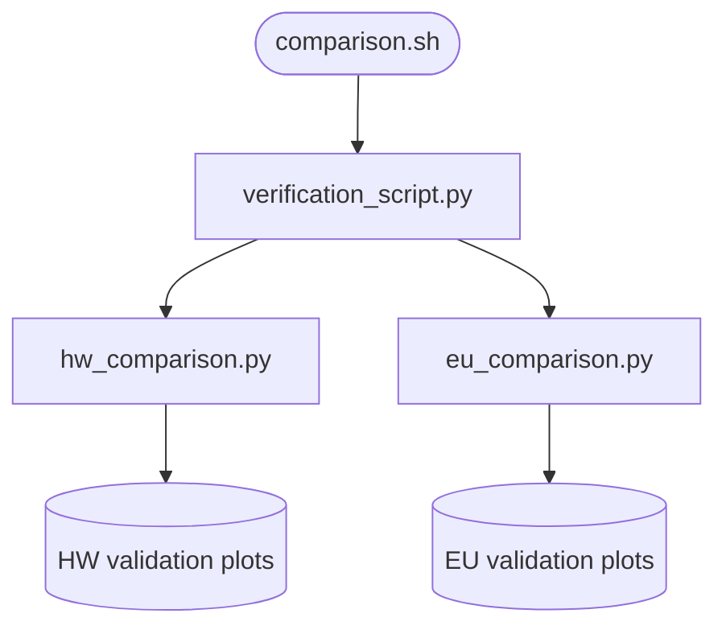

# pop_validation_scripts

## Sections
| Section | Purpose |
| --- | --- |
| `What This Module Does` | Explains the aim of the validation stage |
| `How It Fits In` | Shows where this stage sits in the full workflow |
| `Scripts in This Folder` | Summarises the role, inputs, and outputs of each script |
| `Execution Flow` | Gives a compact visual view of the validation workflow |
| `Run Instructions` | Lists the commands most users will actually run |
| `Smart Behaviors` | Notes practical details about validation and reruns |
| `Parameters` | Collects the configuration settings specific to this stage |
| `Known Issues / TODOs` | Flags current caveats and limitations |

## What This Module Does
This module checks whether pipeline outputs are plausible and consistent with reference datasets. It focuses on HydroWASTE and EU comparisons plus broad verification summaries.

## How It Fits In
It runs after the population-enriched Voronoi stage. Its outputs are diagnostic tables, figures, and logs that act as a quality gate when inputs or parameters change.

## Scripts in This Folder
| Script | Role | What it does | Key inputs | Key outputs |
| --- | --- | --- | --- | --- |
| `comparison.sh` | shell launcher | Runs the validation sequence | config values and named `--level`/`--version`/... overrides | logs plus validation outputs |
| `verification_script.py` | Python worker | Builds general verification summaries | pipeline outputs and reference layers | verification tables and diagnostics |
| `hw_comparison.py` | Python worker | Compares outputs against HydroWASTE | verification subsets and HydroWASTE references | comparison figures and metrics |
| `eu_comparison.py` | Python worker | Compares outputs against the EU reference layer | verification subsets and EU WWTP reference | comparison figures and metrics |

## Execution Flow


## Run Instructions
### Standard
```bash
cd src
bash pop_validation_scripts/comparison.sh
```

### Direct module runs
```bash
cd src
python -m src.pop_validation_scripts.verification_script
python -m src.pop_validation_scripts.hw_comparison
python -m src.pop_validation_scripts.eu_comparison
```

### HPC
```bash
cd src
sbatch pop_validation_scripts/comparison.sh
```

A successful run writes outputs under `data/verification/.../plots` and logs under `logs/pop_validation_comparison.log`.

## Smart Behaviors
- The comparison wrapper runs verification, HydroWASTE comparison, and EU comparison in one sequence.
- The comparison modules skip yearly columns that fail validity checks rather than hard-failing the entire run.
- Verification coverage is controlled by `percent_verification`.

Delete the verification output directory to force a full rerun.

## Parameters
| Config key | Default | Effect |
| --- | --- | --- |
| `verification_script.percent_verification` | `0.8` | Verification coverage threshold |
| `hw_comparison.paths.hw_plots_dir` | template | HydroWASTE plot output directory |
| `eu_comparison.threshold` | null | EU comparison threshold |
| `eu_comparison.paths.eu_ref_filepath` | template | EU reference input |
| `verification_script.paths.verification_dir` | template | Verification output directory |
| `verification_script.paths.pop_output_dir` | null | Population-enriched Voronoi input |

## Known Issues / TODOs
- No explicit `TODO` or `FIXME` markers were found in this module.
- Validation quality depends on the presence of comparable yearly fields in the reference datasets.
