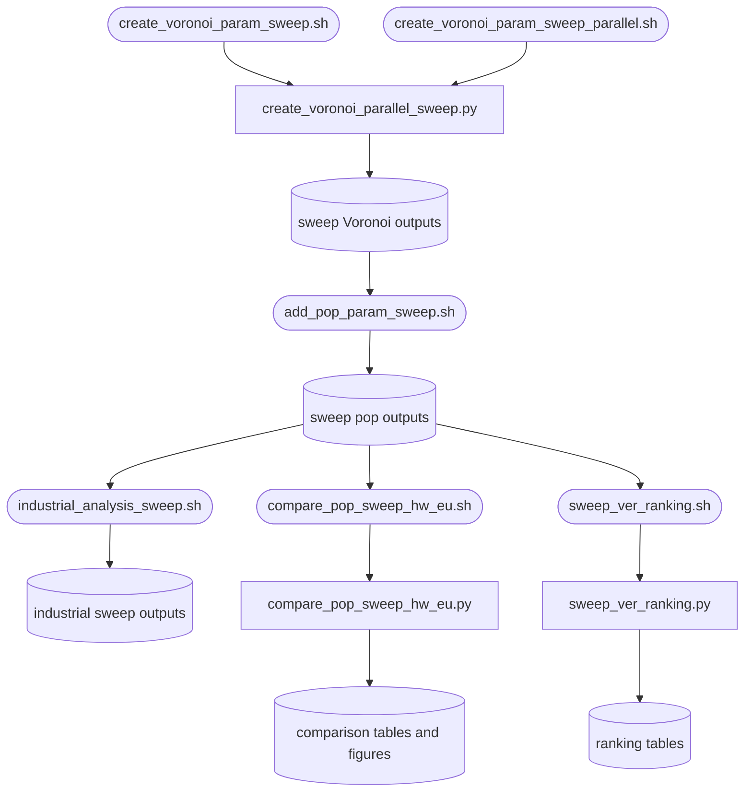

# sensitivity_analysis_scripts

## Sections
| Section | Purpose |
| --- | --- |
| `What This Module Does` | Explains the aim of the sweep and comparison stage |
| `How It Fits In` | Shows how this stage relates to the main production workflow |
| `Scripts in This Folder` | Summarises the role, inputs, and outputs of each script |
| `Execution Flow` | Gives a compact visual view of the sweep workflow |
| `Run Instructions` | Lists the commands most users will actually run |
| `Smart Behaviors` | Notes practical details about sweep logic and deduplication |
| `Parameters` | Collects the configuration settings specific to this stage |
| `Known Issues / TODOs` | Flags current caveats and limitations |

## What This Module Does
This module runs parameter sweeps and cross-run evaluation for the core model. It stress-tests level, buffer, weight method, weight function, and industrial-analysis choices so you can see how sensitive the outputs are to configuration changes.

## How It Fits In
It is an experiment and evaluation layer on top of the main pipeline. It reuses the same workers as the production flow but runs them across many parameter combinations and then scores the resulting outputs.

## Scripts in This Folder
| Script | Role | What it does | Key inputs | Key outputs |
| --- | --- | --- | --- | --- |
| `create_voronoi_param_sweep.sh` | shell launcher | Runs the standard Voronoi sweep as a 10-way SLURM array | parameter grid definitions and array task id | per-task Voronoi sweep outputs |
| `create_voronoi_param_sweep_parallel.sh` | shell launcher | Runs the higher-resource Voronoi sweep variant | array task id and internal job count | parallelized sweep outputs |
| `create_voronoi_parallel_sweep.py` | Python worker | Executes one sharded Voronoi sweep task | sharded parameter combinations | Voronoi outputs plus logs |
| `add_pop_param_sweep.sh` | shell launcher | Sweeps population attachment across Voronoi outputs | task id and parameter grid | population-enriched sweep outputs |
| `industrial_analysis_sweep.sh` | shell launcher | Sweeps the industrial analysis branch | task id and industrial grid settings | industrial sweep outputs |
| `compare_pop_sweep_hw_eu.sh` | shell launcher | Compares sweep outputs against HW and EU references | sweep outputs and reference layers | comparison tables and figures |
| `compare_pop_sweep_hw_eu.py` | Python worker | Aggregates and scores sweep outputs | population-enriched sweep layers and references | alias maps, summaries, and ranking tables |
| `sweep_ver_ranking.sh` | shell launcher | Ranks the sweep's verification subsets | sweep verification outputs and the EU reference layer | ranking tables |
| `sweep_ver_ranking.py` | Python worker | Scores each sweep run's verification subsets against the EU reference | verification `.gpkg` outputs and the EU reference layer | per-subset and overall ranking CSVs |
| `create_voronoi_param_sweep_parallel_additive.sh` | shell launcher | Parallel sweep variant restricted to the additive weighting regime | array task id and internal job count | additive-regime sweep outputs |
| `create_voronoi_single_additive_test.sh` | shell launcher | Single-combination smoke run of the additive regime | one parameter combination | one Voronoi output plus logs |

## Execution Flow


## Run Instructions
### Typical sequence
```bash
cd src
sbatch sensitivity_analysis_scripts/create_voronoi_param_sweep.sh
sbatch sensitivity_analysis_scripts/add_pop_param_sweep.sh
sbatch sensitivity_analysis_scripts/create_voronoi_param_sweep_parallel.sh
sbatch sensitivity_analysis_scripts/industrial_analysis_sweep.sh
sbatch sensitivity_analysis_scripts/compare_pop_sweep_hw_eu.sh
sbatch sensitivity_analysis_scripts/sweep_ver_ranking.sh
```

### Direct debug run
```bash
cd src
python -m src.sensitivity_analysis_scripts.create_voronoi_parallel_sweep 0 2 "" "" --approach 1 --num-jobs 4
```

A successful run writes shard logs plus sweep outputs under the configured Voronoi, population, industrial, and comparison directories.

## Smart Behaviors
- The Voronoi sweep scripts build rigid and dynamic buffering regimes and shatter the combinations across SLURM array tasks with deterministic shuffling.
- Redundant runs with empty `weight_func` are deduplicated so the sweep does not repeat equivalent combinations.
- The parallel Voronoi sweep worker filters combinations for one shard, splits them across internal jobs, and retries failed runs.
- `add_pop_param_sweep.sh` maps the SLURM task id to the Voronoi file index and runs all matching configurations for that index.
- `industrial_analysis_sweep.sh` runs both industrial raster vectorization and unconnected-area detection for each assigned combination.

Delete the sweep output directories to force a rerun.

## Parameters
| Config key | Default | Effect |
| --- | --- | --- |
| `create_voronoi_parallel_sweep.paths.buffers_dir` | null | Buffer directory input |
| `create_voronoi_parallel_sweep.paths.voronoi_dir` | null | Voronoi output directory |
| `compare_pop_sweep_hw_eu.paths.eu_ref_filepath` | null | EU reference input |
| `compare_pop_sweep_hw_eu.threshold` | null | Comparison threshold |
| `compare_pop_sweep_hw_eu.hw_weight` | `0.7` | Weight of the HydroWASTE term in the combined score |
| `compare_pop_sweep_hw_eu.eu_reference_factor` | `1` | Multiplier applied to `uwwCapacity` to obtain served population |
| `sweep_ver_ranking.percent_verification` | template | Share of each run's sites used for verification |
| `sweep_ver_ranking.hw_weight` / `eu_reference_factor` | null | Inherited from `compare_pop_sweep_hw_eu` so both rankings score identically |

The former `eu_utm` key is gone: the EU reference layer's projection is now
estimated from the layer itself (`geo_utils.estimate_utm_crs`) by the shared
`load_eu_reference_layer` helper, so metre distances stay honest wherever the
reference data sits.

## Known Issues / TODOs
- `create_voronoi_param_sweep.sh` and `create_voronoi_param_sweep_parallel.sh` encode their parameter grids directly in the shell script rather than in `config.yaml`.
- No explicit `TODO` or `FIXME` markers were found in this module.
